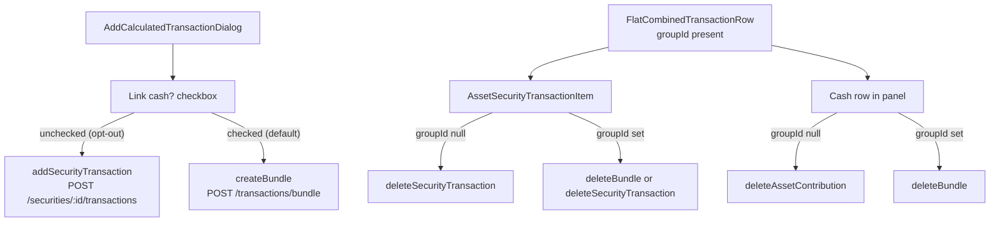
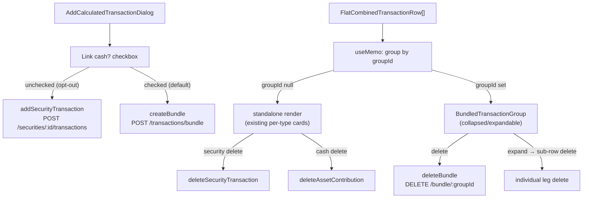

# Bundle UI Integration

## Context

The bundle API (`POST /:assetId/transactions/bundle`, `DELETE /:assetId/transactions/bundle/:groupId`) is now live. The `FlatCombinedTransactionRow` already carries `groupId?: string | null`. The UI needs to:

1. Offer an opt-in "link cash movement" path when adding an investment trade.
2. Delete both legs when the user deletes a row that belongs to a bundle.

Standalone flows (no cash leg) are unchanged.

---

## Files Changed

### 1. New hook — `client/src/hooks/use-transaction-bundle.ts`

Two mutations wrapping the new endpoints:

- `createBundle` — `POST /api/assets/:assetId/transactions/bundle`, validates response with `transactionBundleResponseSchema`, invalidates `assetFlatTransactions` + graph query keys.
- `deleteBundle` — `DELETE /api/assets/:assetId/transactions/bundle/:groupId`, same invalidations.

Follows the same pattern as [`use-asset-contribution-create.ts`](client/src/hooks/use-asset-contribution-create.ts).

---

### 2. [`AddCalculatedTransactionDialog.tsx`](client/src/components/account/AddCalculatedTransactionDialog.tsx)

Current: investment submit always calls `addSecurityTransaction` (standalone leg).

Change: add a `Checkbox` labelled "Also record portfolio cash impact" in the investment form phase (default **checked** — bundle is the expected path for most manual trades).

When checked, `handleInvestmentSubmit` calls `createBundle` instead of `addSecurityTransaction`. When unchecked (opt-out, for direct-from-bank/passthrough accounts), it falls back to `addSecurityTransaction`:

- `securityLeg` = the security transaction insert (same values as today).
- `cashLeg` derived automatically — no new form fields:
  - Buy → cash out: `currencyValue = -abs(securityLeg.currencyValue)`, `value = same`
  - Sell → cash in: `currencyValue = +abs(securityLeg.currencyValue)`, `value = same`
  - `valueDate` matches the security leg.

---

### 3. [`AssetSecurityTransactionItem.tsx`](client/src/components/account/AssetSecurityTransactionItem.tsx)

Current: delete always calls `deleteSecurityTransaction` (single leg).

Change: check `transaction.ledgerGroupId`:

- **null** → existing behaviour (single leg delete, existing dialog text).
- **non-null** → replace the delete `Dialog` body with two action buttons:
  - "Delete trade only" → calls `deleteSecurityTransaction` (leg only).
  - "Delete trade and cash" → calls `deleteBundle(assetId, transaction.ledgerGroupId)`.

Uses `deleteBundle` from `use-transaction-bundle`.

---

### 4. [`CalculatedTransactionsPanel.tsx`](client/src/components/account/CalculatedTransactionsPanel.tsx)

Current: cash row delete always calls `deleteAssetContribution`.

Change: for `row.transactionType === "asset"` rows with `row.groupId` non-null:

- Show a small badge/label "Linked to trade" beside the cash movement label.
- Delete calls `deleteBundle(assetId, row.groupId)` instead of `deleteAssetContribution`.

Rows with `row.groupId === null/undefined` keep existing delete behaviour.

Edit (pencil) on a bundled cash row: no change for now — editing remains on the individual cash leg (this is acceptable for MVP; full bundle edit is a follow-up).

---

## Data flow summary



---

---

### 5. New component — `client/src/components/account/BundledTransactionGroup.tsx`

Renders one logical event (a security + cash pair sharing a `groupId`) as a **single collapsible card**.

**Collapsed state (default):**
- Primary label: security name + direction (Buy/Sell) + share quantity.
- Secondary line: date · consideration amount · "2 legs" badge.
- Chevron icon (right-aligned) to expand.
- Delete button: calls `deleteBundle(assetId, groupId)` with a single confirm ("Delete trade and linked cash movement?").

**Expanded state:**
- Shows the collapsed header row, chevron pointing up.
- Below: two indented sub-rows using the existing `AssetSecurityTransactionItem` and cash row markup respectively, with their own individual edit/delete actions (individual leg delete).

Props: `{ groupId, securityRow: FlatCombinedTransactionRow, cashRow: FlatCombinedTransactionRow, securities: UserAssetSecuritySelect[], assetId: string }`

---

### 6. [`CalculatedTransactionsPanel.tsx`](client/src/components/account/CalculatedTransactionsPanel.tsx) — grouped rendering

Replace the flat `visibleRows.map(...)` with a derived ordered list of **render items**:

```
type RenderItem =
  | { kind: "standalone"; row: FlatCombinedTransactionRow }
  | { kind: "bundle"; groupId: string; securityRow: FlatCombinedTransactionRow; cashRow: FlatCombinedTransactionRow }
```

Logic (in a `useMemo`):
1. Collect rows with a non-null `groupId` — pair them by `groupId` into `bundle` items (security + cash legs). Use the `securityRow.valueDate` as the sort key for the bundle.
2. Rows with `groupId === null/undefined` → `standalone` items.
3. Sort all render items chronologically by their effective date (bundle uses security leg date).

Render:
- `standalone` → existing per-type render (no change).
- `bundle` → `<BundledTransactionGroup ... />`.

Bundled cash rows no longer appear independently in the flat list (they are consumed into their bundle item), so the "Linked to trade" badge and bundled cash delete from todo `panel-cash` are handled inside `BundledTransactionGroup` instead.

---

## Data flow summary (updated)



---

## Out of scope
- Edit flow for bundles (editing individual legs continues to work as before).
- Automatic cash inference or triggers.
