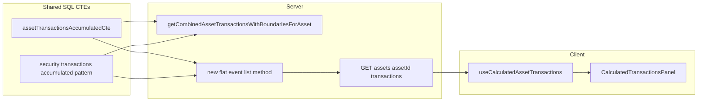

# CalculatedTransactionsPanel (cash + securities)

**Canonical plan** for this work. (An older duplicate filename [`calculated_contributions_ux_ed683b57.plan.md`](calculated_contributions_ux_ed683b57.plan.md) only redirects here.)

## Product decisions (locked)

- **Tab label:** The assets page tab is **`Transactions`** (replace the current **Contributions** label on [`asset.tsx`](client/src/pages/asset.tsx)). Chart / values behaviour unchanged; only the tab copy (and internal tab `value` if you rename for clarity).
- **Recurring:** **Security recurring only** — same as today: [`RecurringContributionSecurityDialog`](client/src/components/account/RecurringContributionSecurityDialog.tsx) / [`RecurringContributionsList`](client/src/components/account/RecurringContributionsList.tsx). **No** asset-type recurring entry from this panel (`RecurringContributionDialog` stays for manual `TransactionsPanel` only).
- **Date range:** The **transaction list does not** follow [`DateRangeContext`](client/src/context/DateRangeContext.tsx) for v1 — load **full** history (or server default “all rows”). **In-list filters / range** are a later iteration; do not wire the list to the global date range bar yet.
- **Add Transaction (calculated accounts):** Single toolbar control **“Add Transaction”** opens a **new** multi-step dialog (not [`TransactionsDialogue`](client/src/components/account/TransactionsDialogue.tsx) as the shell). Step 1: user chooses **cash movement** vs **investment**. Subsequent steps use flow titles **“Cash Transaction”** and **“Investment Transaction”**, embed **existing** forms, and let the user indicate **purchase vs withdrawal** with **branch-appropriate** wording. **OCR** is unchanged and treated as **investment**-oriented statement import (not part of this dialog).

## Adding cash (`asset_transactions`)

**What “cash” means in the app:** Account-level money in/out stored in **`asset_transactions`** (see schema comments and [docs/portfolio-time-weighted-return.md](docs/portfolio-time-weighted-return.md): inflow positive / outflow negative on `currencyValue` where applicable).

### Decided (implementation baseline)

- **Persistence:** Unchanged — cash leg still **`POST/PUT/DELETE /api/assets/:assetId/contributions`** ([`createUserAssetTransaction`](server/services/assets/database.ts) etc.); investment leg still **security transaction** endpoints used by [`SecurityTransactionUpsertDialogue`](client/src/components/account/SecurityTransactionUpsertDialogue.tsx) / [`useSecurityTransactions`](client/src/hooks/use-security-transactions.ts).
- **Client mutations:** Reuse existing hooks; extend invalidation to the **combined flat list** query when implemented. Optional: **toast copy** tuned for calculated-account flows (e.g. “Cash transaction saved” / “Investment saved”) via thin wrappers or hook options — **without** changing default toasts for [`TransactionsPanel`](client/src/components/account/TransactionsPanel.tsx) unless product wants global copy updates.
- **Forms:** **Reuse** [`TransactionSingleForm`](client/src/components/account/TransactionSingleForm.tsx) (and its schema) inside the **Cash Transaction** branch; reuse the **investment** form stack from [`SecurityTransactionUpsertDialogue`](client/src/components/account/SecurityTransactionUpsertDialogue.tsx) (or extract inner form if the dialogue cannot be nested cleanly). **New shell:** a dedicated **Add Transaction** dialog component that orchestrates step 1 (choice) → step 2 (embedded existing form) and supplies **purchase vs withdrawal** UX (toggle or segmented control) with **different helper text** for cash vs investment where needed. **Do not** replace [`TransactionsDialogue`](client/src/components/account/TransactionsDialogue.tsx) globally — it remains for manual `TransactionsPanel`.

### Product / UX decisions (locked)

1. **Entry:** One toolbar button **“Add Transaction”** opens the new dialog. First screen: user chooses **“cash movement”** or **“investment”** (exact control copy can match design system).
2. **Dialog:** **New** multi-flow component; within the flow use headings **“Cash Transaction”** and **“Investment Transaction”** respectively; **reuse existing forms** beneath those steps.
3. **Purchase vs withdrawal:** Handled **inside** this single dialog (after type choice). User can denote **purchase** or **withdrawal**; **language alternates** appropriately between **Cash** and **Investment** branches (e.g. deposit/withdraw vs buy/sell — final strings at implementation with product review). Implementation must still map to **existing** payloads (signed `asset_transactions` for cash; security transaction semantics for investments — **no backend behaviour change** without explicit sign-off).
4. **OCR:** **No change** to OCR behaviour or placement. **Presumption:** OCR / “Add from upload” continues to represent **investment** (security) transaction intake; it is **not** wired through the new cash vs investment chooser.

### Editing existing rows (implementation note)

- **List row actions** should open the **appropriate** editor: cash rows → same cash form (inside the shell or a slim edit-only variant); security rows → existing [`AssetSecurityTransactionItem`](client/src/components/account/AssetSecurityTransactionItem.tsx) / upsert dialogue pattern. Whether edits reuse the **full** Add Transaction shell in “edit mode” or only the inner forms is an implementation detail; preserve current mutation contracts.

## Naming

- Component file and export: **`CalculatedTransactionsPanel`** (correct spelling of “Transactions”).
- **`SecuritiesTransactionsPanel`:** Avoid behavioural or layout changes beyond what is needed for **deduplication** — specifically, replace the existing OCR block with a **shared component** so both panels stay in sync (see below). All other panel logic remains as-is unless a follow-up explicitly refactors it.

## Shared OCR block (zero duplication)

- **Goal:** One implementation of: pending OCR banner, active-item state, and [`OcrResultReview`](client/src/components/ocr/OcrResultReview.tsx) wiring (as today in [`SecuritiesTransactionsPanel.tsx`](client/src/components/account/SecuritiesTransactionsPanel.tsx) ~lines 187–206), driven by [`useAssetOcrPendingReview`](client/src/hooks/use-asset-ocr-pending-review.ts).
- **Deliverable:** New file under e.g. [`client/src/components/account/`](client/src/components/account/) or [`client/src/components/ocr/`](client/src/components/ocr/) — name TBD (`AssetContributionsOcrSection`, `AssetStatementOcrBlock`, etc.) — props should cover `assetId`, `asset` (or minimal shape `OcrResultReview` needs), and any upload-dialog concerns stay **out** of this extract if they remain panel-specific, **or** the extract owns “pending + inline review” only while each panel keeps its own “Add from upload” dialog button (match current split of responsibilities).
- **Consumers:** [`CalculatedTransactionsPanel`](client/src/components/account/CalculatedTransactionsPanel.tsx) (new) and [`SecuritiesTransactionsPanel`](client/src/components/account/SecuritiesTransactionsPanel.tsx) (swap inline JSX for the shared component).

## Backend-first combined list (reduce client merge work)

**Why not only `getCombinedAssetTransactionsWithBoundariesForAsset`:** That method is **boundary- and range-aware** by design (name + behaviour): it feeds chart/TWR-style pipelines where synthetic or window edge rows may appear. A **Contributions / activity panel** usually wants a **flat list of real events** (concrete `asset_transactions` and `security_transactions` rows, merged and ordered), with **accumulator columns** still derived from the **same window/CTE logic** as the combined stream so running balances stay consistent. Reusing the method verbatim may therefore be wrong for UX even though the underlying CTEs are right.

**Preferred approach:** Introduce a **new service method** (name TBD, e.g. `getFlatCombinedAssetTransactionsForAsset` or similar) that:

- Reuses the **same CTE modules / builders** used inside [`getCombinedAssetTransactionsWithBoundariesForAsset`](server/services/assets/database.ts) — e.g. [`assetTransactionsAccumulatedCte`](server/services/assets/query.ts) and the security accumulated select pattern — so aggregated fields (`accumulativeAssetCurrencyValue`, etc.) do not drift.
- Returns a **list-oriented** shape: merged sort (`valueDate`, stable secondary key per docs), **only rows that map to user-visible events** unless product explicitly wants boundary rows in the list.
- Keeps [`getCombinedAssetTransactionsWithBoundariesForAsset`](server/services/assets/database.ts) as the source for **graph / portfolio transaction history** paths that need boundaries.

**What the client has today:**

- [`GET .../transactions/graph`](server/routes/assets.ts) → day-bucketed combined history (chart).
- [`GET .../portfolio-value/transactions`](server/routes/assets.ts) → day-bucketed combined history across assets.

**Gap:** No per-asset REST handler for a **flat event list** backed by the new method.

**Plan:** Add **`GET /api/assets/:assetId/transactions`** (or `/transactions/combined` / `/activity` if clearer next to `/securities/.../transactions`). Handler: `parseQueryParamsExpress`; **v1** call returns **unbounded / full** list when no filter params (matches “no global date range” on client). Optional `start`/`end` (or shared filter object) can exist for **future** list filters — not used by the panel initially. Body from the **new** flat-list service method. Response DTO: Zod parse (extend [`transactionAbstractSchema`](shared/schema/transaction.ts) or a dedicated list-row schema including `assetSecurityId` / `securityName` as needed).

**Caching:** `@Cached` / `@InvalidatesCache` for the new method should align with asset transaction + security transaction mutations (same namespaces as related asset queries).

## Client

- One query hook for the panel list (e.g. `useCalculatedAssetTransactions`) — **no client-side merge** of contributions + security lists for the main feed.
- **Mutations** stay on existing endpoints: security rows → existing security transaction mutations; asset rows → existing contribution CRUD. After mutations, invalidate the **new** combined list query key (and any graph keys if needed).
- Row rendering: branch on `transactionType` — reuse **`AssetSecurityTransactionItem`** where `security` (needs resolved security name if the flat DTO does not include it; confirm server payload or enrich route).
- **Add:** New **Add Transaction** multi-flow dialog (see § Adding cash). **Edit/delete** cash rows: reuse contribution hooks + forms; **edit/delete** security rows: unchanged from `AssetSecurityTransactionItem` pattern.
- **Synthetic / boundary rows:** The list endpoint should **omit** non-event rows if the new service method filters them; if any remain, hide edit/delete or style as “system” (product).

## Integration

- [`asset.tsx`](client/src/pages/asset.tsx): for `isSecuritiesAsset`, render `<CalculatedTransactionsPanel … />` instead of `<SecuritiesTransactionsPanel … />` (same props: `asset`, `assetId`, `statementPlatformKey`).

## Verification

- `npm run check` after substantive changes.
- No new tests unless requested.

## Diagram

