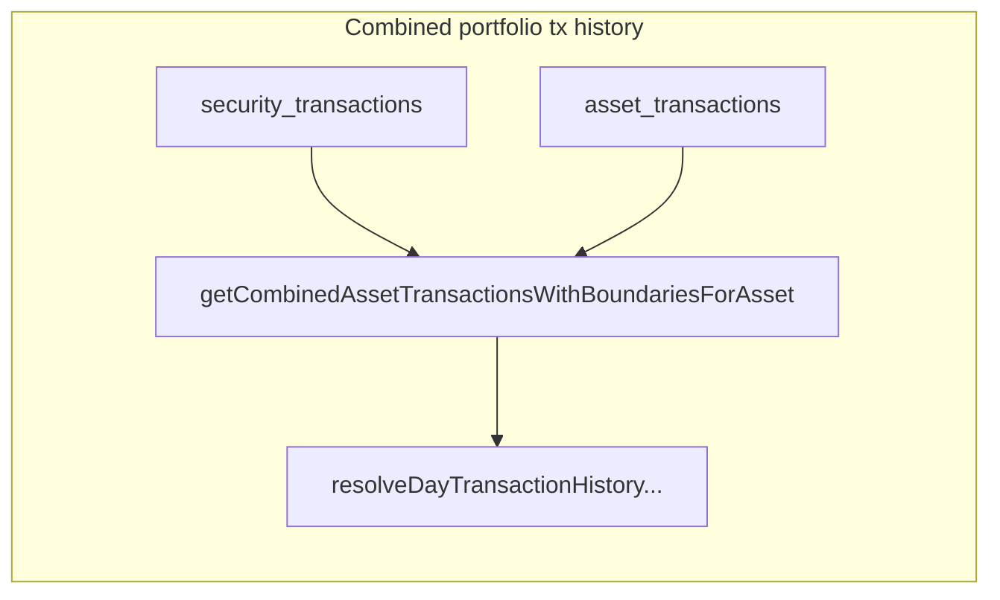

# Cash holdings, transaction modeling, and TWR alignment

## Approved scope (MVP)

- **Adopted:** first-class cash via **`asset_transactions`** for account-level **money in / out**, unified transaction stream, cash in **total MV**, TWR/MWR rules as in §4–5.
- **Data:** the **manual account** feature has **not been used in production**; it may be **removed or repurposed**. Treat **`asset_transactions` as empty of meaningful legacy**—no backfill or migration is required for “old meaning vs new.”
- **MVP** implies the smallest shippable slice: merged history + correct totals; **not** the full list of future niceties (bundles, multi-currency edge cases) unless explicitly in scope.

**Process:** run **`npm run check`** before each commit (repo standard). Keep commits small and focused; use **imperative, sentence-style** subject lines (match the project’s existing habit). Adjust wording if a step spans multiple PRs.

## Progress (MVP implementation)

| Step | Status | Commit (development) |
|------|--------|----------------------|
| **1** Docs + schema semantics for `asset_transactions` | **Done** | `caf826e` — *docs: define asset transactions as account cash movements* |
| **2** Asset CTE + accumulators in [`query.ts`](server/services/assets/query.ts) (`assetTransactionsAccumulatedCte`) | **Done** | `8ad96fe` (with step 3) — *feat(assets): add asset transaction accumulators and merge with security history* |
| **3** Merge asset + security in [`getCombinedAssetTransactionsWithBoundariesForAsset`](server/services/assets/database.ts) (sort by `valueDate`, `id`) | **Done** | `8ad96fe` (same as step 2) |
| **4** | Total MV includes cash (`asset_values` / `calculatedAssetsQueryBuilder` / value pipeline) | **Done** | `1725031` — *feat(assets): include cash in calculated MV and asset value history* |
| **5** | TWR/MWR flow rules in [docs](docs/portfolio-time-weighted-return.md) | **Done** | *docs: portfolio TWR/MWR flow rules with asset and security legs* |
| **6** TWR/MWR API + client (sub-milestone) | **Pending** | — |

**Next focus:** **Step 6** (TWR/MWR API + client), when in scope.

## Implementation steps and suggested commits

Complete in order. Each row is a **discrete deliverable**; the **Example commit** line is a template—split or combine only when it keeps diffs reviewable.

| Step | Outcome | Primary touchpoints | Example commit(s) |
|------|--------|----------------------|-------------------|
| **1** | **Document** `asset_transactions` as **account-level money in / out**; fix schema comment if it still says “manual only” in a misleading way. Sign: e.g. **inflow positive** on `currencyValue`. | [`portfolio-assets.ts`](server/db/schema/portfolio-assets.ts) comment; short addition to [docs/portfolio-time-weighted-return.md](docs/portfolio-time-weighted-return.md) if useful | `docs: define asset transactions as account cash movements` |
| **2** | **Accumulators for `asset_transactions`** per `assetId`: windowed running sum of `currencyValue` in SQL (mirror the security CTE pattern in [`query.ts`](server/services/assets/query.ts) / [`getCombined…`](server/services/assets/database.ts)), output fields compatible with [`BrandedAbstractTransactionValue`](shared/schema/transaction.ts) (`transactionType: 'asset'`, `accumulativeAssetCurrencyValue`, etc.). | `server/services/assets/query.ts`, new or extracted builder; shared mapping types if needed | `feat(assets): add windowed accumulators for asset-level transactions` |
| **3** | **Merge** security history + asset history in [`getCombinedAssetTransactionsWithBoundariesForAsset`](server/services/assets/database.ts): same **range boundary** behaviour as today for securities, **chronological merge**, stable tie-break on same `valueDate`. Portfolio transaction chart APIs unchanged at the route level. | `database.ts` (combined method); re-run/extend any focused tests you add when asked | `feat(assets): merge asset and security transactions for portfolio history` |
| **4** | **Total MV includes cash** for charts/TWR prep: e.g. **cash at date** from summed `asset_transactions` (or running balance) + **securities** from existing `calculateAssetValue` path, OR post-sum when persisting/reading `asset_values`. **latest `currentValue`** in [`calculatedAssetsQueryBuilder`](server/services/assets/query.ts) should reflect **securities + cash** for broker assets. | [`asset-value.ts`](server/services/securities/sync/asset-value.ts) / asset values service; `query.ts` lateral current value; invalidation if needed | `feat(assets): include cash in calculated asset and portfolio value` (or two commits: derivation helper, then wire-up) |
| **5** | **TWR/MWR product rules in docs:** which rows are **external flows** (typically `asset_transactions` net external; security-only buys per §4); point to `shared/utils/portfolio-returns-twr.ts` and `portfolio-returns-mwr.ts` as the pure math. | [docs/portfolio-time-weighted-return.md](docs/portfolio-time-weighted-return.md) | `docs: portfolio TWR flow rules with cash and security legs` |
| **6** | **Post–MVP core (optional sub-milestone):** server composition: merged MV series + **external flow** list → TWR sub-periods / MWR inputs; `GET` extension or new field on portfolio value; client header. **No change** to pure math in [`portfolio-returns-twr.ts`](shared/utils/portfolio-returns-twr.ts). | `server/services/assets`, `server/routes/assets.ts`, client hooks as designed | `feat(portfolio): expose time-weighted return` (split API vs client if large) |

**Out of scope for initial merge (track separately)**

- **`leg_group_id` / direct-invest single API** (bundle two legs) — add after steps 1–4 stable.
- **Recurring** behaviour changes for “to cash” vs “to fund.”
- **returnValue** / cost-basis ratio in `getPortfolioValueForUser` — only change with **explicit** product sign-off (may stay security-only until then).
- **Tests** — per your rule, add when you request them; each step can still be verified via `npm run check`.
- **Dedupe the security CTE (follow-up refactor, not required for this MVP):**  
  [`getCombinedAssetTransactionsWithBoundariesForAsset`](server/services/assets/database.ts) currently defines an inline `transactionsAccumulated` CTE that **duplicates** the select/join/window shape of [`securityTransactionsAccumulatedCTEBuilder`](server/services/assets/query.ts), plus adds `beforeRange` / `afterRange` and uses a different CTE name. **Later, attempt to reuse** a single module-level builder (e.g. extend it with optional `startDate` / `endDate` for those flags, or compose `with(…)`) so the **combined history** and **`getPortfolioValueForUser`** paths share one definition and the long function shrinks. OK to do **after** cash/MV/TWR work is stable; avoid copy-paste drift when changing window logic.

**Definition of done (MVP core: steps 1–5)** merged transaction history is correct, total MV includes cash where specified, `npm run check` passes, documentation matches behaviour. Step 6 is the **return metrics** slice and can ship as a follow-up PR series.

## Current model (ground truth in code)

- **[`user_assets`](server/db/schema/portfolio-assets.ts)** – one broker account (ISA, SIPP, GIA, etc.).
- **[`user_asset_securities`](server/db/schema/portfolio-assets.ts)** – holdings lines linked to [`securities`](server/db/schema/securities.ts).
- **[`security_transactions`](server/db/schema/portfolio-assets.ts)** – rows that update **share count** (`value`) and **currency leg** (`currencyValue`); windowed cumulative sums in [`server/services/assets/query.ts`](server/services/assets/query.ts) / [`getCombinedAssetTransactionsWithBoundariesForAsset`](server/services/assets/database.ts) set `transactionType: 'security'` and feed **portfolio transaction history** ([`getPortfolioTransactionHistoryForUser`](server/services/assets/database.ts) → [`resolveDayTransactionHistoryForAssetsForDateRange`](shared/utils/assets.ts)).
- **[`asset_values`](server/db/schema/portfolio-assets.ts)** – total account MV; for **calculated** assets, sync adds **cumulative** `asset_transactions` to the priced-securities result before insert; [`calculatedAssetsQueryBuilder`](server/services/assets/query.ts) / [`getUserAsset`](server/services/assets/database.ts) use the same idea for `currentValue`.
- **[`asset_transactions`](server/db/schema/portfolio-assets.ts)** – account-level cash in/out. **Implemented:** merged with security rows in [`getCombinedAssetTransactionsWithBoundariesForAsset`](server/services/assets/database.ts) via [`assetTransactionsAccumulatedCte`](server/services/assets/query.ts) (windowed `currency_value`, `transactionType: 'asset'`). [`getUserAssetTransactions`](server/services/assets/database.ts) still returns raw asset-level rows for list UIs.
- **Portfolio charts / overview** use [`mergeSortedAssetHistories`](shared/utils/assets.ts) + [`streamAssetValuesForDateRange`](shared/utils/assets.ts) for **values**; same merge pattern for **transactions** on `BrandedAbstractTransactionValue`.

**Implication:** **Calculated** `asset_values` (sync) and **`currentValue`** (list / `getUserAsset` / `getPortfolioValueForUser` total) include **cash** from `asset_transactions` for `value_method = calculated`. Transaction **history** includes `asset_transactions` and security rows together.

---

## 1) Cash holdings “TradingView style”

**Product goal:** show a **cash** row and include it in **total** MV.

**Viable patterns:**

| Approach | Idea | Pros | Cons |
|--------|------|------|------|
| **A. Synthetic security** | Insert a well-known `securities` row (e.g. `CASH_GBP` / `MNY_MARKET`); `user_asset_securities` + `security_transactions` for balance changes | Reuses **all** security pipelines (positions, tx history CTE, share rolling sum) | Semantics muddled (cash isn’t a “security”); price must stay 1; odd `currencyValue` / share interpretation |
| **B. First-class cash leg** (chosen) | **Holdings:** optional `user_asset_cash` (or derive balance from events). **Transactions:** reuse **[`asset_transactions`](server/db/schema/portfolio-assets.ts)** as **money in / out** (see §1b) | Reuses existing CRUD, Zod, and `transactionType: 'asset'` in [`shared/schema/transaction.ts`](shared/schema/transaction.ts); no second cash table for MVP | **Done:** combined history + cash in **total MV** (steps 2–4); TWR *flow* rules in [docs](docs/portfolio-time-weighted-return.md) (step 5) |
| **C. MV-only** | Store cash only in `asset_values.metadata` or a parallel snapshot table | Smaller schema change | Harder to reconcile **transactions** vs **holdings**; TWR flow boundaries get fuzzy |

**Decided (product):** use **B — first-class cash leg** (holdings + clear cash flows). **Persistence for cash *movements*:** strongly consider **reusing `asset_transactions`** (see **§1b**) instead of a new `cash_transactions` table unless a hard blocker appears.

**Whatever you pick**, **total MV** for charts/TWR should become:

`MV_total = MV_securities + MV_cash` (single currency per scope or explicit FX; align with [docs/portfolio-time-weighted-return.md](docs/portfolio-time-weighted-return.md) FX note).

### 1b) Reusing `asset_transactions` for “money in / out”

**Schema history:** the table was introduced for **manually** logged account activity (comment: manual not calculated—[`portfolio-assets.ts`](server/db/schema/portfolio-assets.ts)). The **manual account feature is unused to date** and may be **removed or repurposed**; there is **no** production burden of reinterpreting old rows.

**MVP direction:** this table is the **canonical store for account-level cash movements**—**Money in / Money out** (sign convention: e.g. inflow positive on `currencyValue`). **Implemented:** these rows are merged (with security stream) in [`getCombinedAssetTransactionsWithBoundariesForAsset`](server/services/assets/database.ts); see `assetTransactionsAccumulatedCte` in [`query.ts`](server/services/assets/query.ts).

- **If** a manual / non-broker account type is kept or reintroduced later: that flow can be **only** `asset_transactions` + `asset_values` (no `security_transactions`).
- **Broker-style accounts with securities:** same table for **deposits, withdrawals, transfers** that hit **cash**; **security** legs stay in `security_transactions`. “Direct from bank” into a fund: **two** persisted events (§5) in MVP when you want a clean split—`asset_transaction` legs + `security_transaction`, unless you allow a **temporary** single security-only row for speed.

**Why not a new `cash_transactions` table for MVP:** avoids duplicate APIs and two posting paths. Optional later: columns such as `leg_group_id` / `flow_kind` on `asset_transactions`.

**Implementation caveats (no legacy migration):** (1) **Accumulators** for `asset_transactions` in the combined stream are **in place** (window CTE). (2) **Product/UI** can say “Cash” while the DB table name stays `asset_transactions`. (3) **Document** the chosen semantics for **new** data only (see Step 1 commit + [portfolio-time-weighted-return](docs/portfolio-time-weighted-return.md)).

---

## 2) Managing cash transactions vs security transactions

**Current state (after steps 1–5):**

- **Security:** in combined history (`transactionType: 'security'`). **`getPortfolioValueForUser` “return”** still uses **security** cumulative values only (unchanged; product may revisit).
- **Asset (cash) rows:** included in the same **combined** stream (`transactionType: 'asset'`) and sorted with security rows. **Total MV** and **`asset_values`** for **calculated** include cash (`1725031`).

**Optional polish (not MVP):**

1. New enum `cash` vs reusing `asset` for `TransactionType` if naming clarity is needed.
2. **Recurring contributions** – [`recurring_contributions`](server/db/schema/portfolio-assets.ts) already has `type: 'asset' | 'security'`; “to cash” vs “to fund” behaviour when that feature ships.
3. TWR *composition* in the API (step 6) using §6 in [docs/portfolio-time-weighted-return.md](docs/portfolio-time-weighted-return.md).

---

## 3) What to reuse in the existing codebase

| Area | Reuse |
|------|--------|
| **Daily portfolio series** | [`resolveDayValueHistoryForAssetsForDateRange`](shared/utils/assets.ts), [`streamAssetValuesForDateRange`](shared/utils/assets.ts), [`mergeSortedAssetHistories`](shared/utils/assets.ts) – unchanged contract if **input** `asset_values` (or per-asset series) already include cash in total. |
| **Transaction merge** | Same merge + `getCombinedDayValuesForValues` for **transaction** time points – extend **inputs**, not the core merge algorithm. |
| **TWR / MWR math** | [`shared/utils/portfolio-returns-twr.ts`](shared/utils/portfolio-returns-twr.ts), [`shared/utils/portfolio-returns-mwr.ts`](shared/utils/portfolio-returns-mwr.ts) – **pure**; no DB. |
| **Valuation recompute** | [`__updateAssetValues` / `__updateAssetValuesChunked`](server/services/securities/sync/asset-value.ts) – **post-pass** cash onto calculated totals before `insertAssetValues` / staging (step 4). |
| **Zod + branded decimals** | Existing patterns in [`server/db/schema/utils`](server/db/schema/utils.ts) and transaction schemas. |

---

## 4) TWR (and MWR) when cash exists

**Market value (numerator of sub-periods):** TWR needs **total** portfolio value at boundaries. Cash must be **in** that series (or explicitly zero with product acceptance). The linker in `timeWeightedReturnFromSubPeriods` does not care *how* MV was built—only that **sub-periods are flow-free** and **V⁻/V⁺** around flows are correct.

**External flows:** Under the product rule in the doc, **only net external** movements split the timeline. Classify at composition time:

- **Inflows / outflows** that move **bank ↔ portfolio** (including “deposit to cash”): **TWR flow** (if your product treats them as external).
- **Buy / sell** that are **only** `security_transactions` with **no** change to external money (internal): **not** a TWR flow at consolidated level—*but your current data model often encodes a buy as a single security row with `currencyValue` looking like “money in,” which is **not** the same as accounting for a cash leg.* Adding **explicit cash** makes it possible to model **net external** vs **internal transfer** correctly when you are ready (without changing TWR math).

**MWR (Modified Dietz / IRR):** [`modifiedDietzReturn`](shared/utils/portfolio-returns-mwr.ts) and [`moneyWeightedIrrSolveAnnual`](shared/utils/portfolio-returns-mwr.ts) need **consistent** dated flows + BMV/EMV; BMV/EMV must **include** cash. Same sign convention discipline as today.

**Practical sequencing:** (1) make **total MV** correct including cash; (2) define which rows contribute to **external flow schedule**; (3) feed [`timeWeightedReturnFromSubPeriods`](shared/utils/portfolio-returns-twr.ts) / MWR inputs.

---

## 5) “Direct from bank” into a security (no visible cash in the UI)

**Scenario:** the user’s money **never** appears as a long-lived “cash balance” in the broker’s UX—it goes **straight** into a fund or stock the same day (common for **direct debit**, **bank transfer to purchase**, or **subscription**). You still have two economic events: **(1) external inflow** and **(2) internal use of that money to buy the instrument**.

**With a dedicated cash leg (B), do you need both a cash row and a security row?**

**Yes, for a consistent ledger**—if you want `cash` + `securities` to **reconcile** to total MV and to separate **TWR external flows** from **internal** cash→security moves. You do **not** have to make the user enter them as two separate screens.

| Pattern | What gets persisted | External vs internal (TWR) | UX |
|--------|----------------------|----------------------------|-----|
| **Two legs, one user action (recommended default)** | Same `valueDate` (or ordered intraday with a fixed convention): (a) **cash inflow** +£X; (b) **security** purchase: shares up, and a matching **cash outflow** −£X (or paired `leg_group_id`). | **One external** flow: the bank inflow. The pair (cash out + security in) is **internal** to the portfolio—**not** a second TWR “flow” if net external was already captured at the cash inflow. | Single wizard: “Invest £1,000 from bank into VWRL” creates **both** rows in one request. |
| **Single leg only (security line)** | One `security_transaction` with `currencyValue` = cost, shares updated. | Matches **today’s** “external-only rows” story if product treats that row as **net external** money—but **cash balance in the app is wrong** (missing inflow, missing cash out) until you impute. OK for a migration period; **not** a clean B model. | Simplest data entry, weaker reconciliation. |
| **Composite / bundle record** (optional) | One parent `investment_intent` (or `transfer_batch_id`) with **child** cash + security rows. | Same TWR as two legs: **external** = sum of true bank movements on that batch; **internal** = children that net. | Best audit trail; more schema/API work. |

**Ordering / same day:** TWR in this codebase uses **daily** MV; [docs/portfolio-time-weighted-return.md](docs/portfolio-time-weighted-return.md) already notes a **timing convention** for sub-periods (e.g. flow at **close**). For “same-day bank + buy,” a practical rule is: **(i)** apply inflow, then **(ii)** apply buy so end-of-day MV = securities + (zero or small) cash. The geometric linker does not need “intraday” order if you only have **end-of-day** valuations—as long as **V⁻** and **V⁺** around any **dated external** flow are consistent with that convention.

**Summary:** Favour **two persisted legs** (cash + security) for model B, exposed to the user as **one** action when the real-world case is “direct from bank.” **Single security-only** rows may remain a **pragmatic MVP** shortcut where full two-leg entry is not yet in the UI.

---

## Open details (post-MVP or parallel track)

1. **Composite / `leg_group_id`** in v1 or v2 for bundled “direct from bank” flows.
2. **Server-side** merged transaction stream — **done** (see Progress table).
3. **TWR flow tagging** (external vs internal) on rows or at composition time.
4. **Refactor / reuse security transaction CTE** (see “Out of scope” above).

**Status:** steps **1–5** are implemented on `development` (see **Progress**; step 4 = `1725031`). **No** `asset_transactions` legacy migration. **Next (optional sub-milestone):** **Step 6** (TWR/MWR API + client) using the flow rules in [docs/portfolio-time-weighted-return.md](docs/portfolio-time-weighted-return.md) §6.
