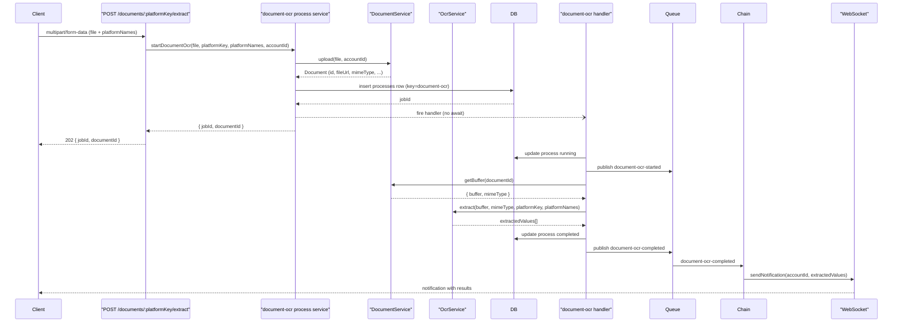

# DocumentUpload OCR Refactor — Phase 2

> **Prerequisite:** [Document Service Infrastructure](document_upload_ocr_88264883) (Phase 1) must be complete. This plan depends on `DocumentService` (`upload`, `getBuffer`, `delete`) and the `/api/documents` route being in place.
>
> This plan originates from the OCR refactor discussion: [OCR refactor — DocumentUpload](4d4ac1c1-d5bc-463e-9625-c8496d742676).

## Approach

The HTTP request is non-blocking. The client uploads a file, gets `{ jobId, documentId }` back immediately as a `202 Accepted`, and waits. Anthropic processing runs in the background following the same `processes` + queue + WebSocket pattern used by `asset-values` and `securities-cache`. Results are pushed to the client over WebSocket when the job completes.

Anthropic's API natively supports: `image/jpeg`, `image/png`, `image/gif`, `image/webp`, `application/pdf`. Unsupported MIME types are rejected in the handler before calling Anthropic.

### Follow-on: extraction quality and security-transaction capture

The Phase 2 payload today is **`ExtractedAmount[]`** (`platformName`, `amount`, confidence, etc.), which is **not** sufficient to build rows aligned with **`security_transactions`** and [`securityTransactionOrphanInsertSchema` / `securityTransactionInsertSchema`](shared/schema/transaction.ts) (e.g. **share `value`**, **`currencyValue`**, **`valueDate`**, security identity for `assetSecurityId` resolution).

See **[OCR text-first pipeline and capture schema](ocr_text-first_pipeline.plan.md)** for:

- Mapping to the DB table [`security_transactions`](server/db/schema/portfolio-assets.ts) and shared Zod.
- A planned **candidate** extraction schema, resolution layer, and product split (asset snapshot vs security holdings).
- **Text-first PDF** extraction and multi-step LLM improvements.
- **Orchestration / multi-agent libraries** plus **provider-agnostic LLM access** (swap models, multiple providers, local/Ollama, future non-OCR features such as search): evaluation criteria and time-boxed spike before heavy graph work.
- **Forwarded email as input** — OCR will need a **processing path** for email-origin documents (converge on `documents` + `document-ocr`); **how** email is received (HTTP vs other) is **TBD**—see [OCR text-first pipeline plan](ocr_text-first_pipeline.plan.md) § “Email-origin input → OCR processing path”.

---

## Service Boundaries

```
DocumentService          OcrService                  ProcessOrchestrator
─────────────────        ──────────────────────      ──────────────────────────────
upload(file,             extract(                    startDocumentOcr(
  accountId)               buffer,                    file, platformKey,
  → stores to S3           mimeType,                  platformNames, accountId
  → inserts documents      platformKey,             )
    row                    platformNames            → DocumentService.upload()
  → returns Document     )                          → insert processes row
                           → calls Anthropic        → fire handler (no await)
getBuffer(documentId)      → returns                → return { jobId, documentId }
  → fetches from S3          ExtractedAmount[]
  → returns
    { buffer, mimeType }
```

- `DocumentService` owns all document persistence and file storage. The choice of S3 is an internal decision — nothing in the OCR layer references S3 directly.
- `OcrService` knows only about buffers, MIME types, and platform context. It has no knowledge of documents, processes, or storage. It can be used independently of any upload flow.
- The process orchestrator (`document-ocr.ts`) composes the two services. The distributed handler also uses them directly.

---

## Platform: known vs unknown

The broker platform may or may not be known at upload time. It is encoded as a URL path parameter.

- **Known platform** — user selects a platform before uploading. The `:platformKey` is the platform's identifier (e.g. `investengine`). The handler constructs a targeted extraction prompt scoped to that platform.
- **Unknown platform** — user does not select a platform. The `:platformKey` is the sentinel value `unknown`. The handler takes a different path: it first asks Anthropic to identify the platform from the document, then extracts values. **The identification prompt and the mapping back to known broker platforms in the database are to be confirmed before handler implementation begins.**

---

## Flow




---

## 1. Shared schema additions — `shared/schema/document.ts`

Add to the existing file (do not create a new schema file):

- `extractedAmountSchema` — `{ platformName: string, amount: number, confidence: number, accountType?: string }` — mirrors the `ExtractedAmount` interface in `server/services/anthropic.ts`; makes the type shared and Zod-validated
- `documentOcrResponseSchema` — `{ jobId: string, documentId: string }` — the `202` HTTP response shape

TypeScript types inferred and exported from `shared/schema/index.ts`.

---

## 2. Queue messages — `server/services/distributed/queue.ts`

New message types following the existing pattern:

```typescript
type DocumentOcrMessageBase = { jobId: string; accountId: string; documentId: string };

type DocumentOcrStartedMessage = DocumentOcrMessageBase & {
  type: "document-ocr-started";
};

type DocumentOcrCompletedMessage = DocumentOcrMessageBase & {
  type: "document-ocr-completed";
  extractedValues: ExtractedAmount[];
};

type DocumentOcrFailedMessage = Omit<DocumentOcrMessageBase, "jobId"> & {
  type: "document-ocr-failed";
  jobId?: string;
  message?: string;
};
```

`DocumentOcrMessage` union added to the `Message` union type. `isDocumentOcrMessage` type guard added.

---

## 3. Process schema — `shared/schema/process.ts`

Add `DocumentOcrProcess` type:

```typescript
type DocumentOcrProcess = Omit<DBProcessSelect, "key" | "payload"> & {
  key: "document-ocr";
  payload: {
    documentId: string;
    platformKey: string;
    accountId: string;
  };
};
```

---

## 4. `OcrService` — `server/services/ocr/index.ts`

`OcrService` class:

- `extract(buffer: Buffer, mimeType: string, platformKey: string, platformNames: string[]): Promise<ExtractedAmount[]>`
  - Converts buffer to base64
  - Constructs the Anthropic prompt — known platform path uses targeted extraction; unknown platform path is **TBC**
  - Calls Anthropic with the correct `media_type` for the given `mimeType`
  - Validates response with `extractedAmountSchema`
  - Returns validated `ExtractedAmount[]`

No knowledge of documents, processes, or storage. The existing `server/services/anthropic.ts` is left untouched — `OcrService` is the new home for this responsibility going forward.

---

## 5. Process orchestrator — `server/services/process/document-ocr.ts`

Function `startDocumentOcr(file, platformKey, platformNames, accountId)`:

- Calls `DocumentService.upload(file, accountId)` → receives `Document`
- Inserts a `processes` row: `key: "document-ocr"`, `status: "pending"`, `payload: { documentId, platformKey, accountId }`
- Calls `handler({ jobId, documentId, platformKey, platformNames, accountId, mimeType })` **without await** (`.catch` logs only)
- Starts TTL reconciliation via `startPeriodicReconciliationForResource`
- Returns `{ jobId, documentId }` immediately

---

## 6. Handler — `server/services/process/document-ocr-distributed-handler.ts`

`Event = { jobId, documentId, platformKey, platformNames, accountId, mimeType }`

Follows the same pattern as `[server/services/process/asset-values-distributed-handler.ts](server/services/process/asset-values-distributed-handler.ts)`:

- Updates process status `pending → running`, publishes `document-ocr-started`
- Validates `mimeType` against Anthropic-supported types — if unsupported, updates to `failed`, publishes `document-ocr-failed`
- Calls `DocumentService.getBuffer(documentId)` to retrieve file buffer
- **Branches on platform knowledge:**
  - `platformKey !== "unknown"` → targeted extraction via `OcrService.extract(...)`
  - `platformKey === "unknown"` → platform identification path (**TBC**)
- Updates process status `→ completed`, publishes `document-ocr-completed` with `extractedValues`
- On any unhandled error: updates status `→ failed`, publishes `document-ocr-failed`

---

## 7. Chain subscriber — `server/services/distributed/chain.ts`

New subscriptions added alongside existing ones:

- `document-ocr-started` → `sendNotification(accountId, { type: "notification", message: "Processing document..." })`
- `document-ocr-completed` → `sendNotification(accountId, { type: "document-ocr-completed", extractedValues })` — client uses this to render results
- `document-ocr-failed` → `sendNotification(accountId, { type: "notification", message: "Document OCR failed: ..." })`

---

## 8. Route addition — `server/routes/documents.ts`

Add to the existing documents route (created in Phase 1):

### `POST /:platformKey/extract`

- `requireUser` middleware
- `multer().single("file")` middleware — `memoryStorage`; accepts `file` part + optional `platformNames` JSON string field
- Calls `startDocumentOcr(req.file, req.params.platformKey, platformNames, req.user.accountId)`
- Returns `202 { jobId, documentId }`

Full path: `POST /api/documents/:platformKey/extract`

---

## 9. Client hook — `client/src/hooks/use-document-upload.ts`

React Query `useMutation`:

- Input: `{ file: File, platformKey: string, platformNames: string[] }`
- Builds `FormData`: appends raw `File` as `file` field + `platformNames` as JSON string field
- Posts `multipart/form-data` to `POST /api/documents/:platformKey/extract`
- Returns `{ jobId, documentId }` from the `202` response
- No extracted values in the HTTP response — results arrive via WebSocket

---

## 10. Client component — `client/src/components/record/DocumentUpload.tsx`

Props: `{ assets, onExtractedValues }` (same interface as `ScreenshotUpload`):

- File-picker and drag/drop accepting `image/`* and `application/pdf`
- No `FileReader`, no base64 — raw `File` objects only
- Platform selector — user optionally pre-selects a known platform from their assets, or leaves as "Unknown" (sentinel `unknown`)
- `platformNames` derived from selected assets and passed to the hook
- On submit: calls `useDocumentUpload` mutation → shows a processing/waiting state displaying `jobId`
- Listens via `use-socket` WebSocket for a `document-ocr-completed` message matching the active `jobId`
- On receipt: renders the review/edit/verify UX:
  - Platform name display (and correction if needed)
  - Account type selector
  - Extracted value display with edit capability
  - Confidence indicator per extracted value
  - Match indicator linking to known assets
  - Calls `onExtractedValues` on save
- On `document-ocr-failed` message: displays inline error (no toast)

---

## 11. Wire into `record.tsx`

Replace `<ScreenshotUpload ... />` with `<DocumentUpload ... />` on the "Account Values" tab in `client/src/pages/record.tsx`. `ScreenshotUpload` is left in place as reference.

---

## Future consideration: dedicated `ocr_jobs` table

### Why the `processes` table must not own OCR tracking

The `processes` table is a **generic, ephemeral job lifecycle tracker**. It is designed to be purgeable — old completed or failed job rows are candidates for cleanup. This is intentional and correct.

OCR tracking has a fundamentally different retention requirement:

- An OCR record must live as long as its parent `document` lives
- A `document` lives as long as it is linked to a transaction — potentially years
- A cleanup sweep of `processes` would silently destroy the OCR audit trail for documents still linked to active transactions
- **The ephemeral, destroyable nature of job history must not be coupled to domain audit data — doing so hinders the maintainability and purgeability of the `processes` table itself**

Additionally, relying on `processes` for OCR tracking causes:

- Domain results (`extractedValues`) living in a generic `jsonb results` column — wrong table, wrong concern
- Querying OCR history requiring JSON extraction (`payload->>'documentId'`) — not a proper FK, not queryable at scale
- The `processes` table accumulating domain meaning it was not designed for — an abstraction leak
- Retry logic becoming unclear — which process row represents which OCR attempt for a document?

### Proposed solution: dedicated `ocr_jobs` table

```
ocr_jobs
id                uuid PK
document_id       uuid FK -> documents.id (ON DELETE SET NULL)
process_id        uuid FK -> processes.id (ON DELETE SET NULL)
platform_key      text
status            enum (pending, running, completed, failed, aborted)
extracted_values  jsonb
error             text
started_at        timestamp
completed_at      timestamp
created_at
updated_at
```

- Both `document_id` and `process_id` are nullable (`ON DELETE SET NULL`) — the OCR record survives independent of both the document being deleted and the process row being purged
- `extracted_values` lives here as a domain result, not in `processes.results`
- One document can have many `ocr_jobs` rows (full retry history)
- Orphan queries become trivial: `SELECT * FROM ocr_jobs WHERE document_id = X AND status = 'failed'`
- The `processes` table remains a pure, purgeable job lifecycle tracker — its destroyable nature is fully preserved

**This is confirmed as the right approach and should be planned as a follow-on migration after this plan ships.**