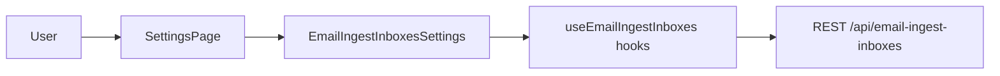

# Document inbound email ingest — settings UI

## Scope boundaries (execution)

- **Touch only `client/`** when implementing: new components under `client/src/components/email-ingest/`, and the minimal embed in [`client/src/pages/settings.tsx`](client/src/pages/settings.tsx).
- **Do not edit** `server/`, `infrastructure/`, `migrations/`, or other non-client paths without explicit approval. Prefer consuming existing [`shared/schema/email-ingest.ts`](shared/schema/email-ingest.ts) and hooks as **read-only** imports from the client; if a gap truly requires changing `shared/` or the API, **stop, describe the gap, and ask** rather than patching the server silently.
- **`npm run check`** may typecheck the whole repo; that is fine as verification. The **diff** for this feature should remain under `client/` unless the user approves an exception.

## Placement (no new page or route)

- **Embed only:** Mount the feature on the existing [`client/src/pages/settings.tsx`](client/src/pages/settings.tsx). **Do not** add a lazy route in [`client/src/App.tsx`](client/src/App.tsx), **do not** add `client/src/pages/email-ingest-inboxes.tsx`, and **do not** add Header/nav links solely for this feature unless you later choose to (out of scope for this revision).
- **Consolidated component:** Implement one **exported root** under `client/src/components/email-ingest/` (name suggestion: `EmailIngestInboxesSettings` or `DocumentEmailIngestSettings`) that **consolidates all behaviour**—data hooks, local UI state, create + allow-list forms, copy affordance, revoke/regenerate confirmations, and API error surfacing. Smaller presentational pieces may live alongside it as non-exported or co-exported modules **only** if they remain orchestrated by that root so a future move to a dedicated page is “import one component + render”.
- **Future page:** When/if a standalone route is desired, the new page should be a thin shell that renders the same root component inside `ResponsiveLayout` / `ProtectedRoute`—no logic fork.

## Data and validation (reuse only)

- **Types/schemas:** Import and use [`shared/schema/email-ingest.ts`](shared/schema/email-ingest.ts) — `emailIngestInboxCreateRequestSchema`, `emailIngestInboxUpdateAllowedSendersRequestSchema`, `emailIngestAllowedSenderSchema` / list max **200**, status enum, nullable `ingestAddress`.
- **Hooks:** Use [`client/src/hooks/use-email-ingest-inboxes.ts`](client/src/hooks/use-email-ingest-inboxes.ts) exclusively for IO; do not duplicate `fetch` wiring.
- **List filtering:** Local `useState` for `includeRevoked` passed into `useEmailIngestInboxes({ includeRevoked })` (query key already varies per option).

## UI structure (fat root component, thin settings glue)

Suggested split **inside the feature folder** (root composes everything; settings page only adds the section chrome if needed):

1. **Root (`EmailIngestInboxesSettings` etc.):** owns `includeRevoked`, selected inbox for editing (if any), success banner state after create/regenerate, and passes props/handlers to children if split.
2. **List + row / Card:** **status** (badge: active/revoked), **shortCode**, **platformKey** (muted when null), **createdAt** / **revokedAt**, **replacedByInboxId** (read-only hint when present).
3. **Ingest address block:** `ingestAddress` monospace + **Copy** when non-null; when **null**, neutral **Alert** explaining ingest address is not available server-side (e.g. `EMAIL_INBOUND_MAIL_FQDN` unset)—**do not synthesize** an address from `shortCode`.
4. **Create form:** optional platform key + optional initial allow list.
5. **Allow-list editor:** full-list PATCH (add/remove lines or tags; max 200 via Zod).
6. **Danger flows:** [`client/src/components/ui/alert-dialog.tsx`](client/src/components/ui/alert-dialog.tsx) for **Revoke** and **Regenerate**; regenerate copy must state **new address**, **old address stops working**, and that brokers must be updated.

## Forms: react-hook-form + Zod (repo deps already present)

- Dependencies already in root [`package.json`](package.json): `react-hook-form`, `@hookform/resolvers`, `zod`.
- Use **`zodResolver`** with schemas derived from the shared module (either the exported request schemas directly, or thin client-side wrappers only for form ergonomics).
- **Validation UX:** field-level errors + `setError("root", …)` for submit issues; **no toast for validation errors** (per workspace rules). Optional minimal success toasts only if consistent with nearby Settings patterns—otherwise inline success state after create/regenerate is enough.
- **Create payload shaping:** map empty trimmed `platformKey` to `undefined` before `emailIngestInboxCreateRequestSchema.parse` / mutation so Zod `.min(1)` does not fight blank inputs.
- **Allow list:** default `allowedSenders: []` for PATCH form; on submit send **full replacement** array matching `emailIngestInboxUpdateAllowedSendersRequestSchema`.

## Mutations and server errors

- [`client/src/lib/queryClient.ts`](client/src/lib/queryClient.ts) throws `Error` strings like `409: {"error":"..."}` on failure. Add a tiny helper **inside the feature folder** to **best-effort parse** `{ error: string }` after the status prefix for user-visible **inline / dialog** messaging on 400/404/409.
- **Regenerate success:** mutation returns the **new** inbox; drive UI from `mutateAsync` result: highlight new row / show success panel with new `ingestAddress`. List invalidation from the hook already refreshes revoked rows as needed.
- **Non-blocking hook note (optional client-only polish):** `useRegenerateEmailIngestInbox`’s `onSuccess` could also invalidate `emailIngestInboxDetailKey(oldId)` if you introduce detail-query usage; not required if the panel relies on the list query only.

## `useEmailIngestInbox` usage

- Not strictly required if all editing happens from list data; use it only if you add a **detail drawer** / refetch-on-open for freshness. Otherwise omit to reduce surface area.

## Verification

- Run **`npm run check`** after substantive TS/React edits.
- **Commits:** keep small; messages follow **`[subject] should [action]`** (e.g. “Email ingest settings should list inboxes”, “Settings page should surface email ingest”).

## API gap check (from current code)

- Server routes in [`server/routes/email-ingest-inboxes.ts`](server/routes/email-ingest-inboxes.ts) align with the spec (including **201** on regenerate). **No blocking API gap identified** from prior review; if implementation uncovers a mismatch or missing behaviour that **cannot** be fixed within `client/` alone, **stop, summarise the issue, and ask** for direction (including whether server or `shared/` changes are allowed) before proceeding.
