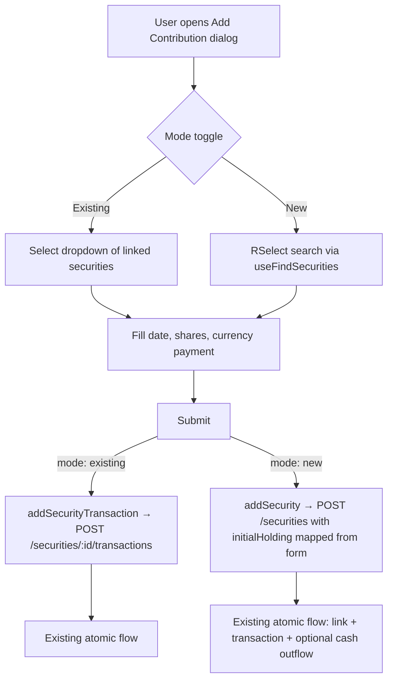

# Inline Security Add in Transaction Dialog

## Goal
Inside `SecurityTransactionUpsertDialogue`, let the user toggle between selecting an existing linked security (current behaviour) and searching for a new security to attach to the asset — all within the same dialog. The "new" path reuses the existing `POST /api/assets/:assetId/securities` endpoint, which already atomically creates the security link and records a `security_transaction` in one DB transaction.

**No new server endpoints, service methods, or shared schema changes required.**

## Why the existing endpoint works

`createUserAssetSecurity` already:
1. Creates the `user_asset_securities` link row
2. Inserts a `security_transaction` using `initialHolding.shareHolding` and `initialHolding.currencyValue`
3. Optionally creates a linked `asset_transactions` cash outflow when `fundedFromCash` is true

The transaction form fields map directly:

- `value` (shares) → `initialHolding.shareHolding`
- `currencyValue` → `initialHolding.currencyValue`
- `valueDate` → `startDate`
- `linkCash` checkbox → `fundedFromCash`

## Affected Files
- [`client/src/components/account/SecurityTransactionSingleForm.tsx`](client/src/components/account/SecurityTransactionSingleForm.tsx)
- [`client/src/components/account/SecurityTransactionUpsertDialogue.tsx`](client/src/components/account/SecurityTransactionUpsertDialogue.tsx)
- [`client/src/components/account/SecuritiesTransactionsPanel.tsx`](client/src/components/account/SecuritiesTransactionsPanel.tsx)

## Flow



## Changes

### 1. `SecurityTransactionSingleForm.tsx` — mode toggle + RSelect

- Add local `securityMode` state: `"existing" | "new"` (default `"existing"`; hidden when `data` prop is provided since edit always has a known `assetSecurityId`)
- Add a two-button toggle above the security field: "Select existing" / "Add new security"
- When `securityMode === "existing"`: render existing `Select` dropdown — no change
- When `securityMode === "new"`: render `RSelect` driven by `useFindSecurities` (same pattern as `AssetSecurityNewFields` in `AssetSecurityForm.tsx`); selected `SecurityInsert` held in local state alongside the RHF form
- Define a client-side discriminated payload type:

```typescript
type SecurityTransactionFormPayload =
  | { mode: "existing"; assetSecurityId: string; value: string; currencyValue: string; valueDate: Date; }
  | { mode: "new"; security: SecurityInsert; value: string; currencyValue: string; valueDate: Date; };
```

- Update `onSubmit` prop to `(data: SecurityTransactionFormPayload, linkCash: boolean) => Promise<void>`
- On form submit: build and emit the discriminated payload based on `securityMode`

### 2. `SecurityTransactionUpsertDialogue.tsx` — type update only

- Update `onSubmit` prop type to accept `SecurityTransactionFormPayload` instead of `SecurityTransactionUpsert`
- No logic changes — the dialogue is a transparent pass-through

### 3. `SecuritiesTransactionsPanel.tsx` — routing

Update `handleTransactionSubmit` to inspect `data.mode`:

```typescript
// mode: "existing" — unchanged path
handleCreateTransaction(data.assetSecurityId, orphanData)

// mode: "new" — reuse existing addSecurity mutation
addSecurity.mutateAsync({
  type: "new",
  security: data.security,
  startDate: data.valueDate,
  initialHolding: {
    shareHolding: data.value,
    currencyValue: data.currencyValue,
  },
  fundedFromCash: linkCash,
})
```

- `addSecurity` is already available from `useAssetSecurities()` which is already called in this component
- Edit path (`handleEditTransaction`) is unchanged

## Notes
- The "new" mode toggle is only shown on create (no `data` prop); edit always uses the existing dropdown
- No server changes of any kind

---

# Phase 2 — Make Initial Transaction Optional When Adding a Security to an Asset

## Goal
When a user adds a security to an existing asset via the "Add Security" dialog (`AssetSecurityUpsertDialog` / `AssetSecurityNewForm`), they are currently forced to provide an initial holding (shares + currency value). This must become optional — a user should be able to link a security to an asset without recording a transaction at the same time.

## Affected Files
- [`shared/schema/portfolio-assets.ts`](shared/schema/portfolio-assets.ts)
- [`server/services/assets/database.ts`](server/services/assets/database.ts)
- [`client/src/components/account/AssetSecurityForm.tsx`](client/src/components/account/AssetSecurityForm.tsx)

## Changes

### 1. `shared/schema/portfolio-assets.ts` — make `initialHolding` optional

`initialHolding` is currently required on both create schemas:
- `userAssetSecurityOrphanNewCreateInsertSchema`
- `userAssetSecurityOrphanLinkCreateInsertSchema`

Make it optional on both:

```typescript
initialHolding: userAssetSecurityInitialHoldingSchema.optional(),
```

`fundedFromCash` is already optional and requires no change. The `userAssetOrphanInsertSchema` (used by the asset creation wizard) inherits from these schemas, so it benefits automatically.

### 2. `server/services/assets/database.ts` — conditionally skip transaction insert and value trigger

**In `createUserAssetSecurity`:** the `security_transaction` insert currently runs unconditionally. Wrap it in a guard:

```typescript
if (data.initialHolding) {
  // existing transaction insert + optional cash outflow logic
}
```

When `initialHolding` is absent, only the `user_asset_securities` link row is created.

**In `createUserAssetSecurityAndTriggerUpdates`:** the fire-and-forget `assetValuesService.updateAssetValuesForAssetOfAccount` call currently always fires after `createUserAssetSecurity`. It must only fire when a transaction was actually recorded — recalculating asset values when no transaction exists is unnecessary work:

```typescript
if (data.initialHolding) {
  this.assetValuesService.updateAssetValuesForAssetOfAccount(
    userAccountId,
    assetId,
    data.startDate
  );
}
```

### 3. `client/src/components/account/AssetSecurityForm.tsx` — make initial holding fields optional in the UI

- The `initialHolding.shareHolding` and `initialHolding.currencyValue` fields in `AssetSecurityNewFormFields` should no longer be required in the form schema
- Add a UI toggle or checkbox: "Record initial transaction" (default off)
- When toggled on: show the shares held, currency value, and funded from cash fields
- When toggled off: fields are hidden and omitted from the submitted payload

## Notes
- This change is backwards compatible — the server accepts a payload without `initialHolding` and simply creates the security link only
- The asset creation wizard (`userAssetOrphanInsertSchema`) is unaffected in behaviour since its securities array already allows zero items; individual security entries will now also allow no `initialHolding`

---

> A separate plan covers the wider unification of all "add security to asset" entry points across the application, including schema consolidation, multiple initial transactions, and the accumulative transaction concept.