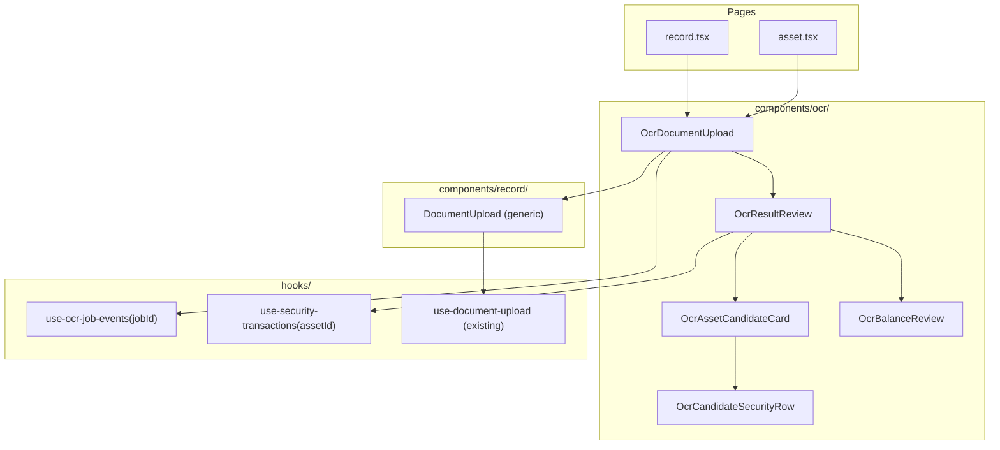

# OCR Frontend Components Plan

## Why `use-socket` cannot be reused as-is

[`use-socket.ts`](../../../client/src/hooks/use-socket.ts) only handles two message types: `query`
(queryClient invalidation) and `notification` (toast). OCR events (`document-ocr-completed`,
`document-ocr-started`, `document-ocr-failed`, `document-ocr-aborted`) are a completely separate
union not present in `SocketMessage`. The hook also has no mechanism to subscribe/filter by event
type or `jobId`. A dedicated `use-ocr-job-events` hook is therefore required. Long-term,
`use-socket` could become a shared context/multiplexer — that refactor is out of scope here.

---

## Component & hook architecture



---

## Pieces in detail

### 1. `DocumentUpload` — generic refactor

**File:** [`client/src/components/record/DocumentUpload.tsx`](../../../client/src/components/record/DocumentUpload.tsx)

Currently owns platform selector, WS subscription, and result display — all OCR-specific.
Refactor to a configurable generic upload UI:

- Props: `accept`, `label`, `children` (slot for consumer-provided controls), `onUploadResponse(response)`, `uploadMutation` (passed in so the consumer controls the endpoint)
- Emits `onUploadResponse(DocumentOcrResponse)` and `onError(Error)` — nothing more
- No WS, no platform selector, no result display
- Upload state (`idle | uploading | error`) stays internal — minimal surface

### 2. `use-ocr-job-events` — new hook

**File:** `client/src/hooks/use-ocr-job-events.ts`

Extracts the raw WS lifecycle currently embedded in `DocumentUpload`'s `useEffect`:

```ts
type OcrJobStatus =
  | { status: "idle" }
  | { status: "processing" }
  | { status: "complete"; extractedValues: ExtractedAmount[]; pipeline: DocumentOcrPipelineResult }
  | { status: "failed"; message: string }
  | { status: "aborted"; message: string };

export function useOcrJobEvents(jobId: string | null): OcrJobStatus
```

- Opens a WS connection only when `jobId` is non-null
- Parses and type-narrows `document-ocr-*` events, filtered to the given `jobId`
- Closes on unmount or when job reaches a terminal state
- All WS logic lives in the hook — no socket code in any component

### 3. `OcrDocumentUpload` — OCR-specific wrapper

**File:** `client/src/components/ocr/OcrDocumentUpload.tsx`

Composes `DocumentUpload` and `use-ocr-job-events` for the OCR upload flow:

- Renders the platform `<Select>` above `DocumentUpload`
- Calls `useDocumentUpload()` mutation and passes it to `DocumentUpload`
- When `onUploadResponse` fires, stores `jobId` and passes it to `useOcrJobEvents`
- When job reaches `complete` → calls `onOcrComplete(result)` prop
- When job reaches `failed | aborted` → inline error message (no toast)
- Renders a processing spinner while `status === "processing"`
- Props: `nominatedAssetId?`, `onOcrComplete`, `onOcrError`

### 4. `OcrResultReview` — candidate tree review

**File:** `client/src/components/ocr/OcrResultReview.tsx`

Receives the completed pipeline result and drives the user review flow:

- Props: `pipeline: DocumentOcrPipelineResult`, `assetId: string`, `onConfirmed()`, `onDismissed()`
- Two sections: candidate matching (securities) and balance extraction
- Applies auto-select rule: if exactly one candidate has `matchedCount === totalCount`, pre-selects
  it; otherwise user picks
- On confirm: calls `useSecurityTransactions(assetId).addSecurityTransaction` per confirmed matched
  row, mapping via `securityTransactionOcrRowToOrphanInsert` from `shared/schema/transaction`
- All review state (selected candidate, row inclusion) is local — no global state

### 5. `OcrAssetCandidateCard` + `OcrCandidateSecurityRow`

**Files:**
- `client/src/components/ocr/OcrAssetCandidateCard.tsx`
- `client/src/components/ocr/OcrCandidateSecurityRow.tsx`

- `OcrAssetCandidateCard`: renders one `OcrAssetCandidateResult` — asset name, match ratio
  (`matchedCount / totalCount`), selectable
- `OcrCandidateSecurityRow`: renders one security row — name/symbol, value, currencyValue,
  confidence badge, `verified` / `matched` status indicators

### 6. `OcrBalanceReview`

**File:** `client/src/components/ocr/OcrBalanceReview.tsx`

Extracts the existing `ExtractedAmount` review UI out of `DocumentUpload`:

- Props: `extractedValues: ExtractedAmount[]`, `assets: UserAsset[]`, `onSave(data)`
- Stateless with respect to upload; receives values and emits save
- No changes to the `onExtractedValues` consumer API on `record.tsx`

---

## Confirmation flow (using existing endpoints)

When the user confirms a candidate in `OcrResultReview`, for each security row where
`matched === true`:

```
securityTransactionOcrRowToOrphanInsert(row.ocrRow)
  → useSecurityTransactions(assetId).addSecurityTransaction({
      securityId: row.userAssetSecurityId,   // already resolved
      data: orphanInsert
    })
```

`useSecurityTransactions` already handles cache invalidation and feedback. No new server endpoint
needed.

---

## Empty and error states

- Zero `assetCandidates`: inform user no holdings matched; show raw `securityHoldings` as read-only
- Zero `extractedValues`: "No account balances could be extracted" (moved to `OcrBalanceReview`)
- `failed` / `aborted`: inline error in `OcrDocumentUpload`
- `verified: false` rows: flagged visually as suspect; user must explicitly include or exclude
  before confirming

---

## Documents page

### Server — new endpoint

A new `GET /api/documents` endpoint is needed, scoped to the authenticated user's account. It should
return documents joined with their `ocr_jobs` row (if one exists) so the client can display
processing status without a second request. Exact response shape TBD when implementing, but at
minimum: `id`, `fileName`, `mimeType`, `createdAt`, `assetId?`, and an optional `ocrJob` object
containing `status`, `platformKey`, `startedAt`, `completedAt`, `error`.

### Client

**Hook:** `client/src/hooks/use-documents.ts`

- React Query `useQuery` against `GET /api/documents`
- Validates response with a Zod schema (to be defined alongside the endpoint)

**Page:** `client/src/pages/documents.tsx`

- Lists all documents for the user account
- Each row shows: file name, MIME type, date uploaded, and — where an OCR job exists — job status
  badge (`running`, `completed`, `failed`, `aborted`) and platform key
- Empty state when no documents exist
- No navigation link wired yet — route registered but not surfaced in the nav

**Route:** registered in the app router alongside existing routes (e.g. `/documents`).

---

## Files touched / created

- **Modified:** `client/src/components/record/DocumentUpload.tsx` — generic refactor
- **Modified:** `client/src/hooks/use-document-upload.ts` — interface alignment if needed
- **Created:** `client/src/hooks/use-ocr-job-events.ts`
- **Created:** `client/src/components/ocr/OcrDocumentUpload.tsx`
- **Created:** `client/src/components/ocr/OcrResultReview.tsx`
- **Created:** `client/src/components/ocr/OcrAssetCandidateCard.tsx`
- **Created:** `client/src/components/ocr/OcrCandidateSecurityRow.tsx`
- **Created:** `client/src/components/ocr/OcrBalanceReview.tsx`
- **Modified:** `client/src/pages/record.tsx` — swap `DocumentUpload` → `OcrDocumentUpload`
- **Modified:** `client/src/pages/asset.tsx` — wire `OcrDocumentUpload` + `OcrResultReview` with
  `nominatedAssetId`
- **Created:** `client/src/hooks/use-documents.ts`
- **Created:** `client/src/pages/documents.tsx`
- **Modified:** app router — register `/documents` route (no nav link yet)
- **New server route:** `GET /api/documents` — documents + OCR job status for authenticated account
