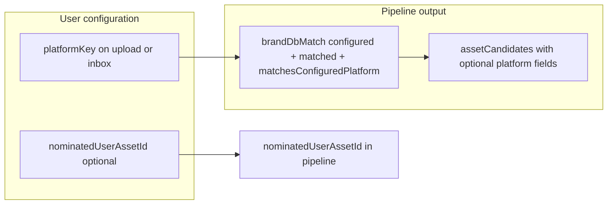

# OCR platform and portfolio alignment: visibility and “platform preference”

## Context (already in the codebase)

- **Configured platform (upload/ingest “preference”)** — `platformKey` is passed into [`runFullDocumentOcrPipeline`](server/services/ocr/transaction-ocr-orchestrator.ts) and becomes **`configuredBrokerPlatformId`** (via `parseConfiguredBrokerPlatformId`) before [`verifyStatementPlatformBrand`](server/services/ocr/transaction-ocr-verifiers.ts).
- **OCR + DB brand match** — [`StatementPlatformBrandDbMatch`](shared/schema/platform-brand-ocr.ts) can include **`matchedBrokerPlatformId`**, **`configuredBrokerPlatformId`**, **`matchesConfiguredPlatform`**, **`ok`**, **`rejectReason`** (including `config_platform_mismatch`).
- **Document pipeline** — [`documentOcrPipelineResultSchema`](shared/schema/document.ts) embeds that match object and **does not** currently expose per-asset `platformId`.
- **Asset candidates (4c)** — [`buildOcrAssetCandidateResults`](server/services/ocr/transaction-ocr-verifiers.ts) loads `user_assets` + holdings but the returned [`OcrAssetCandidateResult`](shared/schema/transaction.ts) has **no** `platformId` field, so the client cannot know “this candidate account is on the same broker platform as the matched statement” without a separate join.

## Product framing: “platform nominee” vs new columns

- **Parity with asset nominee** — Email ingest already stores **asset** preference as [`email_ingest_inboxes.nominated_user_asset_id`](server/db/schema/email-ingest.ts) and **platform** preference as **`platform_key`** (string key → resolves to a broker platform id in the orchestrator). Treat **`platformKey` on the run** as the **platform preference** (“platform nominee” in UI copy) unless you explicitly need a new UUID column; add a new DB field only if product requires a broker-platform id **without** going through the existing `platformKey` resolution path.

## 1) Schema and server: enrich candidates + optional portfolio-level flag

| Change | Where |
|--------|--------|
| Extend **`ocrAssetCandidateResultSchema`** | [`shared/schema/transaction.ts`](shared/schema/transaction.ts) — add e.g. **`userAssetPlatformId: z.string().uuid().nullable()`** and **`alignsWithMatchedStatementPlatform: z.boolean()`** (exact names TBD) computed when **`brandDbMatch.ok`** and **`matchedBrokerPlatformId` !== null` and `user_assets.platform_id === matchedBrokerPlatformId`. |
| Plumb `matchedBrokerPlatformId` (and ok) into 4c builder | [`buildOcrAssetCandidateResults`](server/services/ocr/transaction-ocr-verifiers.ts) / `buildOcrAssetCandidateForAsset` — **include `platformId` in the 4c query** (add to the existing `db.select` from `userAssets`) and set the boolean per candidate. |
| Optional pipeline-level check | [`documentOcrPipelineResultSchema`](shared/schema/document.ts) — add e.g. **`hasPortfolioAccountOnMatchedPlatform: z.boolean()`** (or **`missingPortfolioForMatchedPlatform: z.boolean()`)** computed in the orchestrator **after** candidates: e.g. `ok && matchedId && candidates.some(c => c.alignsWithMatchedStatementPlatform)` (or a tiny follow-up `count` query if you must include assets with **no** holdings, which 4c excludes by design). |

**Edge case (documented in existing plans):** 4c only includes accounts with at least one non-archived holding. A **“no portfolio on this platform”** warning is about **`user_assets.platform_id` coverage**, not only candidates—if you need stricter “do I have *any* account on this platform?”, add a small **count query** on `user_assets` by `user_account_id` + `platform_id` when `matchedBrokerPlatformId` is set.

**Backward compatibility:** New fields should be **optional** with safe defaults in Zod, or only present on new jobs, if you must serve old `ocr_jobs.pipeline` JSON (depends on your strictness).

## 2) UI: platform visibility (prior audit + your new asks)

| Surface | Updates |
|--------|---------|
| [`ocr-pipeline-readonly-panels.tsx`](client/src/components/ocr/results-layout/ocr-pipeline-readonly-panels.tsx) | **“Database match”** section: show **configured** platform id and/or **resolved name** (via [`useBrokerPlatforms`](client/src/hooks/use-broker-platforms.ts) or similar), **`matchesConfiguredPlatform`**, and short plain-language when **`config_platform_mismatch`**. Replace raw UUID for **“Nominated asset”** with **account name** when available (props or lookup from `useAssets` on that page if needed). |
| [`OcrResultReview`](client/src/components/ocr/OcrResultReview.tsx) + [`OcrAssetCandidateCard`](client/src/components/ocr/OcrAssetCandidateCard.tsx) | **Banner** when `configuredBrokerPlatformId` is set: state whether the **document platform matches your selected platform** (`matchesConfiguredPlatform`). **Per candidate**: visual emphasis when **`alignsWithMatchedStatementPlatform`** (e.g. border/badge “Same broker platform as statement”) in addition to existing nominee emphasis. Clarify **copy** that **asset nominee = preference** vs **per-candidate match scores** = holdings alignment. |
| [`OcrDocumentUpload`](client/src/components/ocr/OcrDocumentUpload.tsx) | Label and options use **“platform preference”** (optional), including **no platform preference (identify automatically)** for the `unknown` path, aligned with ingest. |
| [`EmailIngestInboxesSettings`](client/src/components/email-ingest/EmailIngestInboxesSettings.tsx) Add Inbox | **Shipped (§5):** `GET /api/assets/platforms-in-use`, portfolio nominee first, platform `Select` (platforms in use), inference when nominee set, disabled + “No platform preference” when none in use. |

**Optional client-only path (if you want to avoid schema change first):** derive highlight using `useAssets()` + `job.platformKey` + `pipeline.brandDbMatch` — **fragile** if assets list is not loaded on the same screen or if `UserAsset` shape omits `platformId`; **server-enriched booleans** on candidates are the robust approach.

## 3) Documentation / comments

- Update the comment on **`nominatedUserAssetId`** in [`documentOcrPipelineResultSchema`](shared/schema/document.ts) to include **email ingest** and any other entry points, not only “asset-scoped route.”

## 4) Out of scope (unless you expand the plan)

- Changing **OCR / verification business rules** (e.g. hard-fail when no portfolio on matched platform) — this plan is **visibility + optional non-blocking warnings** only; confirm with you before gating the job.
- **New DB columns** for “platform nominee” if **`platformKey`** is deemed sufficient (decision above).

## 5) Email ingest “Add Inbox” — platform as `Select` (platforms in use) — **shipped**

Replace the free-text broker platform field with a **`<Select>`** of **broker platform UUIDs** (same as today’s API `platformKey` when set). Options are **limited to platforms the user is already using**: distinct `user_assets.platform_id` where non-null. **Labeling:** resolve human-readable names the same way as elsewhere (e.g. join broker platform catalog in the service response and/or `useBrokerPlatforms()` on the client) — final shape in implementation.

### Platforms in use API (in scope, integrated)

- **Delivery:** a dedicated **`GET`** (authenticated, tenant-scoped to `userAccountId`) is **part of the same work** as the Add Inbox dialog, not a follow-up. Implement alongside the `Select` + client hook.
- **Behaviour:** return the distinct set of **broker platform ids** the user is already using (same row-level rule as the product: non-null `user_assets.platform_id` for the current account). Empty array is valid when no platforms apply.
- **Module and URL (decided):** implement in [`server/routes/assets.ts`](server/routes/assets.ts) only. The app mounts this router at **`/api` → `/assets`** ([`server/routes/index.ts`](server/routes/index.ts)), so the **public path** is **`GET /api/assets/platforms-in-use`**.

#### Assets route placement (how this file is structured)

- **Collection** routes: `GET` and `POST` on **`"/"`** (list + create) are **first** in the file.
- **Sub-resource** routes: everything else uses [`regExpPath`](server/utils/uuid.ts) with **[`uuidRouteParam("assetId")`](server/utils/uuid.ts)** so the first segment is a **strict UUID** (e.g. `GET /:assetId`, `GET /:assetId/history`, `POST /:assetId/.../extract`). A literal path like `platforms-in-use` is **not** treated as an `assetId` by those regexes, but **registration order** should still be clear for maintainers.
- **Where to add `platforms-in-use`:** register **`GET`** immediately **after** the existing **`GET "/"`** and **`POST "/"`** handlers and **before** the first per-`assetId` `router` (e.g. before `POST` `.../documents/.../extract` at ~line 93). That keeps it with **account-scoped, non–asset-id** reads alongside the list endpoint.
- **Handler shape:** use **`requireUser`**, and **`requireTenantWithUserAccountId`** (match [`GET "/"`](server/routes/assets.ts)) to scope by `tenant.userAccountId`. Use **`regExpPath("/platforms-in-use")`** for the path string, consistent with other routes in this file that are not plain `"/"`.
- **Data:** implement the query in **`DatabaseAssetService`** (or a small dedicated method) per [`server-structure`](.cursor/rules/server-structure.mdc) — keep the route handler thin. Add a Zod list schema in **`shared/`** for the JSON body.

- **Rationale:** Settings does not need a full **assets** list to populate a **platform** control; a small, purpose-built list avoids coupling the page to `useAssets()` shape and payload size.

### UX order and relation to asset nominee (required)

1. **Portfolio account (asset nominee) first** in the form — user picks optional **`nominatedUserAssetId`** (or “None”) before / above platform in the layout.
2. **When a target asset is selected:** **infer** `platform_id` from that asset and **set the platform `Select` automatically** to the matching broker platform (same UUID sent as `platformKey`). The platform control should **reflect that inference** (e.g. disabled or read-only with clear copy) so the two cannot disagree.
3. **When no asset is selected:** the user may **manually** choose a platform from the **filtered** list (platforms in use only), or leave **“No platform preference”**.

### Edge cases (decided)

1. **No platforms in use** (no assets, or no asset has `platformId`): the platform **`Select` still appears**, **disabled**, with the visible value **“No platform preference”** (or equivalent string).
2. **Platform remains optional;** default selection is **“No platform preference”** (submits `platformKey` omitted / null per existing API).
3. **Inboxes are not mutable** after create (no PATCH for platform/nominee today). **Regenerate** continues to **copy** the same stored config values (`platformKey`, `nominated_user_asset_id`, allow list) as already implemented on the server.

### Implementation note

- Reuse **existing** create body: `platformKey` as optional UUID; **`nominatedUserAssetId`** unchanged.
- After implementation: **`npm run check`**; do **not** add DB migrations for this form + read-only `GET` (uses existing `user_assets` columns).

## Suggested implementation order

1. Server: 4c query + `OcrAssetCandidateResult` + orchestrator pass-through for `alignsWith...` and optional portfolio flag.
2. Zod + any persisted pipeline migration tolerance (if strict parsing for old rows).
3. UI: `OcrAssetCandidateCard` + `OcrResultReview` + `OcrPipelineReadonlyPanels` + ingest/upload copy.
4. `npm run check`; **you** run migrations if schema on disk changes (per your rules).
5. **Section 5 (integrated), done:** **Server:** `GET /api/assets/platforms-in-use` in [`server/routes/assets.ts`](server/routes/assets.ts); **client:** [`useAssetsPlatformsInUse`](client/src/hooks/use-assets-platforms-in-use.ts) + Add Inbox in [`EmailIngestInboxesSettings`](client/src/components/email-ingest/EmailIngestInboxesSettings.tsx). Upload copy aligned in [`OcrDocumentUpload`](client/src/components/ocr/OcrDocumentUpload.tsx) (§2).

**Plan status:** All items in sections 1–5 are implemented; section 4 remains intentionally out of scope.
