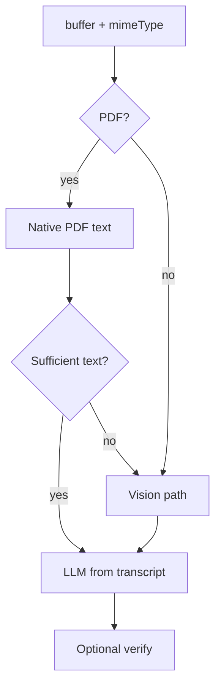

# OCR text-first pipeline and security-transaction capture schema

**Related:**

- [DocumentUpload OCR Refactor — Phase 2](documentupload_ocr_refactor_1e50c3b2.plan.md) (current wire-up uses `ExtractedAmount[]`, which is insufficient for securities).
- **Transaction OCR flow (canonical mermaid):** [`docs/Transaction-OCR-flow.md`](../../docs/Transaction-OCR-flow.md) — document-first, multi-phase AI orchestration (brand / platform then securities), DB and schema verification steps; extend that file as the pipeline evolves.

---

## Problem: current capture schema vs domain target

Today [`extractedAmountSchema`](shared/schema/document.ts) captures:

- `platformName`, `amount`, `confidence`, optional `accountType`

That shape fits **account-level** snapshots (e.g. Record page totals per asset), not **security-level** rows that can populate [`security_transactions`](server/db/schema/portfolio-assets.ts).

### Database: `security_transactions`

Defined in [`server/db/schema/portfolio-assets.ts`](server/db/schema/portfolio-assets.ts) (`securityTransactions`):

| Column | Role |
|--------|------|
| `assetSecurityId` | FK to `user_asset_securities` — **not** extractable from a PDF alone; requires resolution (user portfolio + security identity). |
| `value` | **Number of shares held** (`brandedDecimal`, not null). |
| `currencyValue` | Monetary value (`brandedDecimal`, not null). |
| `fees` | Optional decimal. |
| `currency` | Text (default `GBP`). |
| `valueDate` | As-of date for the holding/snapshot. |
| `recordedAt` | When recorded. |
| `source` | `manual` \| `recurring` \| **`ocr`** \| `import` (set at insert, not from model prose). |
| `flags` | Optional JSON: `estimated`, `suspect`, `verified`. |

### Shared Zod: inserts

[`shared/schema/transaction.ts`](shared/schema/transaction.ts):

- **`securityTransactionOrphanInsertSchema`** — fields without `assetSecurityId`: `value` and `currencyValue` use `decimalValueSchemaRequiredGreaterThanZero`; optional `fees`, `currency`, `valueDate`, `recordedAt`, `source`, `flags`.
- **`securityTransactionInsertSchema`** — extends with required `assetSecurityId`.

Any OCR pipeline that aims at **persisted security transactions** should produce data that can validate against the **orphan** schema (plus separate resolution to `assetSecurityId`), or an explicit **candidate** schema that maps 1:1 to those fields after normalisation.

### Gap (what extraction must add)

At minimum, per **line or holding** on the document:

1. **Security identity** (for resolution): ISIN, ticker/symbol, and/or name + confidence (and optionally platform hints already in hand).
2. **`value`** — share quantity as a decimal string compatible with `decimalValueSchema` / branded decimal rules.
3. **`currencyValue`** — cash value in statement currency.
4. **`valueDate`** (and **`recordedAt`** if the document distinguishes them).
5. Optional **`fees`**, **`currency`** if visible.
6. Optional **evidence** (snippet from transcript) for a future verification step and for `flags.suspect` / human review.

The LLM should **not** emit `assetSecurityId` unless you add an unsafe auto-match; prefer **candidate + UI/service resolution** → then `securityTransactionInsertSchema`.

### Product / API implication

The Record flow today expects **`{ assetId, value }[]`** for **asset** values. Security-transaction capture is a **different** outcome:

- Either introduce an **extraction mode** (e.g. asset snapshot vs security holdings) on upload/route, **or**
- Separate endpoint / process key / client flow for “statement → security transaction candidates”.

Document that choice explicitly before implementing schema swaps on the existing `document-ocr-completed` payload.

### Email-origin input → OCR processing path

Users may **forward** broker or platform emails into the product (e.g. “Your portfolio has been updated”) instead of uploading in the UI. **How those messages reach the app** (webhook, polling, provider-specific ingress, etc.) is **not decided yet**—this plan does **not** prescribe **HTTP routes** or any concrete receipt implementation.

What **is** in scope for product/architecture planning:

- Treat **email-sourced** content as a **second input channel** alongside the existing multipart upload.
- After whatever ingestion layer exists, processing should **converge** on the same primitives as today: **first-class `documents`** (e.g. from attachments or normalised body) and the existing **`document-ocr`** / `startDocumentOcr` style async flow (`platformKey`, queue, WebSocket), so behaviour stays consistent.
- Implementers will need a **clear server-side processing entry** for “email batch → resolved `userAccountId` → buffers/metadata → `DocumentService` + OCR orchestration” (exact API shape **TBD**—could be a **service function** invoked by a future worker, not HTTP).

**Later decisions (outside this plan until ingestion is chosen):** transport auth, envelope → `userAccountId` mapping, MIME vs provider payloads, idempotency (e.g. Message-Id), limits, scanning, and HTML body vs attachment policy.

This is **additive** to manual upload; both channels target **documents + async OCR**.

---

## Text-first and multi-step LLM (quality)

Same approach as discussed: **native PDF text** when sufficient → **text-only** LLM interpretation; **vision fallback** when text is sparse; optional **verify** pass; later **raster OCR** for scanned PDFs.

Implementation phases (unchanged in spirit):

1. PDF text module + heuristic + CLI `--dump-text`.
2. Split `OcrService`: transcript vs vision; orchestration in `extract`.
3. Logging (`path=text|vision`, `charCount`).
4. Optional second LLM pass for groundedness.
5. Optional OCR vendor/Tesseract when text layer empty.

---

## Multi-agent / routing: library evaluation

If the pipeline grows beyond **2–3 explicit steps** (route → extract → verify), a small **orchestration** layer or **graph** library can reduce ad-hoc branching. The stack already uses **`@anthropic-ai/sdk`** directly and **Express**; anything added should justify **bundle size**, **operational complexity**, and **debuggability** in your environment.

### Requirements: provider flexibility and future AI surfaces

These constraints should drive the spike and any long-term abstraction—not only OCR.

1. **Swappable and multiple LLMs** — Ability to **switch providers** (e.g. Anthropic, OpenAI, others) without rewriting every call site; support **different models per use case** (cheap router vs strong reasoner, vision vs text-only, etc.).
2. **Local / self-hosted** — Path to **Ollama** (or similar) for dev, cost control, or privacy-sensitive flows; same calling pattern as cloud where feasible (capability flags when local models lack vision/PDF).
3. **Versatility beyond OCR** — Document upload extraction is the **first** AI use; anticipate **other domains** (e.g. AI-assisted **search**, summarisation, classification, future “reals” or product-specific assistants). The chosen direction should **not** be a one-off OCR wrapper but a **shared server-side pattern** for “call model X with structured in/out”.

Implication: evaluate both **orchestration** (graphs, routing) and **provider abstraction** (unified client or gateway). Options include a **thin internal module** (`LlmGateway` / `complete({ modelRef, messages })`) implemented with vendor SDKs behind an interface, or a **library** that already normalises providers (often with tradeoffs for vision/PDF and streaming).

### Options to compare (spike, do not commit until Phase 1 text-path is stable)

| Direction | Role | Fit for this project |
|-----------|------|----------------------|
| **Plain TypeScript + internal gateway** | Hand-written `LlmClient` interface; per-provider adapters (Anthropic, OpenAI, Ollama HTTP); orchestration stays explicit functions or a tiny state machine. | **Maximum control** for multi-provider + Ollama; **no** graph UX—more code for branching/checkpoints. Best baseline to compare others against. |
| **LangGraph** (JS/TS) | Stateful graphs, branching, human-in-the-loop hooks; often paired with LangChain primitives. | Strong for **named steps** and **conditional routing**; provider story usually via **LangChain chat models** (check Anthropic vision/PDF + **Ollama** coverage in the versions you pin). |
| **LangChain.js** | Chains, Runnables, many **integrations** (cloud + local). | Broad **provider** surface; risk of **large dependency graph**; validate tree size and ESM/Node 24. |
| **Vercel AI SDK** | `generateText` / `streamText`, **multiple providers**, React streaming; community patterns for non-Next server usage. | Good **multi-provider** story; confirm **Express/long-running workers**, **vision/PDF** paths, and **Ollama** support match your OCR and future search flows. |
| **Mastra** | Workflows/agents in TS (newer ecosystem). | Assess **provider list**, stability, and fit with your commit/deps rules. |
| **Workflow engines** (Inngest, Temporal, etc.) | Durable steps, retries—**not** LLM-specific. | Orthogonal: use for **job durability** while keeping LLM calls behind a gateway; does not replace provider abstraction. |

### Selection criteria (use in the spike doc)

1. **Multi-provider and per-use-case models** — Configure **model id / provider** per feature (OCR extract vs verify vs future search) without duplicating HTTP glue everywhere.
2. **Local LLM path** — Ollama (or chosen runtime) callable with the **same abstraction** where capabilities align; explicit **degradation** when local model cannot do PDF/vision (fallback to cloud or text-only transcript path).
3. **Future features** — Same layer usable for **non-OCR** AI (search, classification, etc.) with consistent logging, timeouts, and optional streaming.
4. **Anthropic / vision / PDF today** — OCR must not regress: document + image content must remain expressible (either through the library’s multimodal API or by keeping a **narrow escape hatch** to `@anthropic-ai/sdk` until unified).
5. **Type safety** — Step boundaries align with **Zod** (`shared/schema`).
6. **State and durability** — Align with **`processes`** (and future **`ocr_jobs`**); distinguish **in-memory graph state** from **persisted job state**.
7. **Team cost** — Debuggability in production vs plain functions.
8. **Dependencies** — Match [package.json](package.json) discipline; avoid a heavy tree for a single feature.

### Recommendation in the plan

- **Phase 1 (PDF text + split `OcrService`)** — **No new orchestration library**; keep **explicit routing** in code. Optionally sketch a **minimal `LlmGateway` interface** (signatures only) if it clarifies future refactors—implementation can still call Anthropic directly until the spike completes.
- **Spike (time-boxed)** — Prototype **one** OCR sub-flow (e.g. transcript → structured JSON) using: **(A)** plain TS gateway + 2 providers (e.g. Anthropic + Ollama text), and **(B)** one candidate framework from the table **if** (A) is too much boilerplate for planned branching. Record: provider swap cost, vision/PDF story, dependency weight, and fit for a **hypothetical second feature** (e.g. search).
- **Document the outcome** in this plan or a short internal note: chosen **gateway + orchestration** approach, explicit **non-goals**, and which features must use which **model tier** (router vs extractor vs future search).

---

## Suggested implementation order

1. **Schema & contract** — Add `extractedSecurityTransactionCandidateSchema` (or equivalent) in `shared/schema`, aligned with orphan insert fields + security identity fields; update queue/WebSocket types and handler to emit candidates (may coexist temporarily with `ExtractedAmount` for Record-only flows).
2. **PDF text + LLM split** — As above; prompt JSON must match the new schema.
3. **Resolution service** (separate from `OcrService`) — Map candidate + `userAccountId` → `assetSecurityId` (securities cache, fuzzy name, ISIN lookup); out of scope for pure “OcrService” module.
4. **Client** — Review UI for candidates, mapping to holdings, confirm before insert.
5. **Email-origin OCR path** — Processing entry and normalisation to documents + `document-ocr` once ingestion is decided; **no** HTTP email receipt in this plan until receipt design is agreed.

---

## Documentation

- Keep [DocumentUpload OCR Refactor](documentupload_ocr_refactor_1e50c3b2.plan.md) in sync: add a one-line pointer that extraction payloads will evolve toward security-transaction candidates per this plan.
- Keep [`docs/Transaction-OCR-flow.md`](../../docs/Transaction-OCR-flow.md) as the **living** end-to-end pipeline diagram (mermaid); this plan’s phases should stay aligned with that document when steps change.
