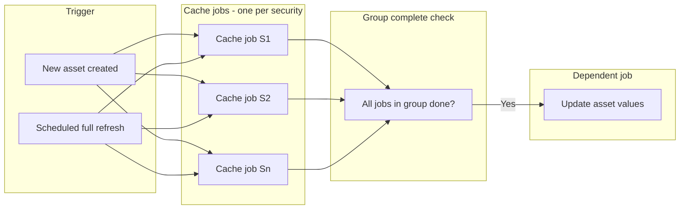

# Process orchestration: requirements and options (documentation)

This document records the requirements, problem statement, patterns, and options discussed. It does **not** define a final implementation plan.

---

## 1. The two processes and how they work together

Two processes must work in unison:

| Process                                 | Purpose                                                               | Dependency                                                         |
| --------------------------------------- | --------------------------------------------------------------------- | ------------------------------------------------------------------ |
| **Update security daily history cache** | Populate `securityDailyHistory` for securities (shared across users). | None (can run on schedule or on demand).                           |
| **Update user asset values**            | Compute asset values from cached history.                             | **Depends on** cache being up to date for that asset's securities. |

Current coupling in the codebase:

- **Scheduled / "full" path:** In [server/services/distributed/chain.ts](server/services/distributed/chain.ts), on `securities-daily-history-cache-update-exited` the chain calls `updateAssetValuesForAllAssetsOfAllAccounts()`.
- **New-asset path:** [server/services/process/asset-values.ts](server/services/process/asset-values.ts) `initAssetValuesForAssetOfAccount()` (used from `createUserAsset`) runs: (1) get asset's securities, (2) `updateSecuritiesDailyHistoryCacheForSecurities(securityIds)`, (3) then `updateAssetValuesForAssetOfAccount`.

So asset values must only run once the relevant cache work is done (either globally or for that asset's securities).

---

## 2. The dilemma (oversight identified)

**Before the last commit:** Triggers always attempted to update **all** securities for **all** assets. Asset values were updated at the end of the securities daily cache update.

**Oversight:** When a user creates a **new asset**, that asset can include securities that are **not yet in the cache**. We must:

- Trigger **immediately** to fetch and fill cache for those new securities.
- **Await** (or otherwise depend on) that cache work before running the asset-values update for that asset.

**Additional constraint:** Cached security history is **shared between users**. So we should avoid duplicate work (e.g. one job per security, not one giant job that reprocesses everything).

**Current gap:** [server/services/process/securities-cache.ts](server/services/process/securities-cache.ts) has `updateSecuritiesDailyHistoryCacheForSecurities(securityIds)` which creates one job with payload `{ securityIds, startDate }`, but [server/services/process/securities-cache-distributed-handler.ts](server/services/process/securities-cache-distributed-handler.ts) **ignores** the job payload and loads **all** `userAssetSecurities` for all accounts. So "for these securities only" is not yet enforced in the handler.

---

## 3. Proposed direction (under consideration)

We are considering:

- **One job per security** (not one job per group of securities). Rationale: cache is shared; one job per security avoids duplicate work and clarifies "this job = this security's cache."
- **Group id in job metadata:** Jobs for "cache for asset A's securities" share a common identifier (e.g. `groupId` = asset id). That allows:
  - Querying "all jobs in this group."
  - **Check group complete:** When every job in the group has finished (completed, failed, or aborted), trigger the **single** "update asset values" job for that asset.

Flow:

1. New asset created → for each of its securities, create one cache job with the same `groupId` (e.g. asset id) and a single `securityId`.
2. Handler runs **one job = one security's** cache update.
3. When a cache job completes (or fails/aborts), run "check group complete" for its `groupId`; if the group is complete, enqueue/trigger the asset-values job for that asset.

This satisfies: no "update all securities" when only a subset is needed; clear dependency (asset values only after cache for that asset's group is done); and aligns with a future distributed/worker architecture.

---

## 4. Industry pattern: Fan-out / Fan-in

What we want is the **fan-out / fan-in** orchestration pattern:

- **Fan-out:** Start N parallel jobs (one per security cache update).
- **Fan-in:** One dependent job (update asset values) runs only after all N jobs have finished.

Other names: Map/reduce (map = N cache jobs, reduce = one asset-values job), job dependency graph (N children → 1 parent). "One job per security + group id + check group complete" is an implementation of this pattern.

---

## 5. Current MVP approach (trigger-and-forget and simple queue)

- **Message queue:** [server/services/distributed/queue.ts](server/services/distributed/queue.ts) — either `LocalQueueService` (EventEmitter) or `SQSQueueService`. Single "message" event; no per-job queues.
- **Trigger-and-forget:** Triggers (e.g. [server/routes/triggers.ts](server/routes/triggers.ts)) call service methods **without awaiting** the full run. The service inserts a row in `processes`, then invokes the handler (in-process or, later, Lambda). The handler publishes completion/failure to the queue.
- **Chain:** `initUpdateChain()` subscribes to the queue and reacts to message types (e.g. `securities-daily-history-cache-update-exited` → update all asset values). Coordination is via DB + queue messages so we can later move handlers to workers or Lambda.

---

## 6. Queue / orchestration options considered (retained for later)

The following options were evaluated for a full queue system. They are **retained for reference** for later work. For MVP we are not adopting any of them (see section 7).

### Option A: BullMQ (Redis)

- **Flows (open source):** `FlowProducer` creates one parent job and N child jobs. Parent stays in `waiting-children` until all children complete, then becomes processable. No custom "check group complete" — the library handles it.
- **Mapping:** Child jobs = "update cache for security S"; parent job = "update asset values for asset A"; one flow = one group.
- **Pros:** Already use **ioredis** elsewhere (e.g. cache); Flows implement fan-out/fan-in directly; retries, priorities, observability.
- **Cons:** Requires a Redis instance for the queue (not yet set up for jobs); job state lives in Redis (could still mirror to `processes` in Postgres for API if desired).

### Option B: pg-boss (PostgreSQL)

- **Storage:** PostgreSQL only (SKIP LOCKED).
- **Dependencies:** No built-in "parent waits for N children." We would implement "group id + check group complete" ourselves (e.g. when a cache job finishes, check if all jobs in the group are done; if so, enqueue asset-values job).
- **Concurrency:** Uses `teamSize` / `teamConcurrency` / `batchSize`; reported to be less straightforward than "set one concurrency number" and has edge cases (e.g. jobs sent with delays).

### Option C: Graphile Worker (PostgreSQL)

- **Storage:** PostgreSQL only; LISTEN/NOTIFY for low latency.
- **Dependencies:** No built-in parent/child. Same approach as pg-boss: group id on jobs + our own "check group complete" then add the asset-values job.
- **Concurrency:** First-class `**concurrentJobs**` (or `concurrency`) — "run up to N jobs at once on this worker." Simple and well-documented.
- **Pros:** No new infrastructure; clear bounded concurrency for "securities cache updates run concurrently with a limit."

### Option D: Workflow orchestrators (Inngest, Trigger.dev)

- Event-driven workflows with "wait for event" / steps. Can model "N tasks then one task" but are heavier (external or self-hosted service). Not chosen for MVP.

---

## 7. Decisions and constraints noted

- **Queue system for MVP:** We do **not** need a full queue system (BullMQ, pg-boss, Graphile Worker) for MVP. We will stick with our **simple queue/event system** (EventEmitter or SQS + `processes` table). We are implementing our grouping mechanism ourselves anyway; the simple queue has what we need for MVP, reflects a distributed architecture, and gives us events we can respond to. The queue options in section 6 are retained for later reference.
- **Redis:** ioredis is imported somewhere but **no Redis instance is set up yet** for job processing. Preference expressed to use a **Postgres-based** queue if possible.
- **Concurrency:** Securities cache updates should run **concurrently with a limit** (e.g. to avoid overwhelming external APIs). Between pg-boss and Graphile Worker, **Graphile Worker** was identified as the better fit for "concurrent with limits" due to its clear `concurrentJobs` option.

---

## 8. Concurrency: application-level buffer/bus (out of scope for this work)

**Out of scope:** The concurrency buffer/bus is **not** part of this work. We presume it will be (or has been) implemented in another PR. The following is retained for reference and for use when that work is done.

We can **decouple concurrency limits from the queue**: the queue treats all securities daily history cache jobs as concurrent; we enforce the limit in our own layer with a **concurrency buffer/bus**.

**Idea:**

- **Queue:** Only delivers work. Every "update cache for security S" job is equal; the queue does not limit how many run at once.
- **Our layer:** A bus (semaphore) that allows only **N** cache-update operations to run at a time. When a worker picks a job, it: (1) acquires a slot from the bus (or waits/retries until one is free), (2) runs the cache update, (3) releases the slot when done.

**Pros:**

- **Queue-agnostic:** We do not depend on the queue's concurrency settings. Same pattern works with the current EventEmitter/SQS + `processes` or with pg-boss, Graphile Worker, etc.
- **Single place for the limit:** One bus, one number (e.g. 5). Easier to tune and reason about.
- **Fits trigger-and-forget:** Queue hands out jobs; the app decides how many cache updates run in parallel (e.g. to avoid overwhelming EODHD/Alpha Vantage).

**Implementation options:**

- **In-process bus:** A fixed-size pool of N permits (e.g. semaphore). Worker: `await bus.acquire()` → run cache update → `bus.release()`. Simple, but **per process**: with 2 worker processes and bus size 5, we get up to 10 concurrent cache updates.
- **Distributed bus:** Slots are global (e.g. Redis INCR/DECR, or Postgres advisory locks / a small "semaphore" table). Then we get a **global** limit across all instances. Slightly more moving parts.

**Caveat:** If a job waits for a slot for a long time, the queue may treat the job as stuck (timeout, visibility). So either: keep "wait for slot" short and bounded and, if no slot, release the job (e.g. fail/retry or put it back) so it is picked again later; or use a queue that allows long-running "in progress" jobs and set timeouts larger than the max wait for a slot.

**Library options:** Rather than building a custom concurrency bus, we can use an existing library. See [docs/Concurrency-Buffer-Options.md](docs/Concurrency-Buffer-Options.md) for a detailed comparison. Summary:

| Library        | Downloads | Size    | API Style                   | Best For                                    |
| -------------- | --------- | ------- | --------------------------- | ------------------------------------------- |
| **p-limit**    | 173M/week | 11.7 kB | Function wrapper            | Simple concurrency limiting                 |
| **async-sema** | 2.1M/week | Small   | Semaphore (acquire/release) | Explicit control, rate limiting             |
| **p-queue**    | 13M/week  | 72.4 kB | Queue-based                 | Prioritization, ordering, advanced features |

**Recommendation:** Use **p-limit** for our use case. It is the most popular, smallest, and simplest option. Usage: `const limit = pLimit(5); await limit(() => fetchData());`. If explicit acquire/release semantics are preferred, **async-sema** (maintained by Vercel) is an excellent alternative.

**Implementation placement:** Apply p-limit at **each API service** (EODHD and Alpha Vantage), **not** at the gateway. The concern is concurrency on **all** calls to the sources of securities cache—regardless of caller (job handlers, scripts, API endpoints, etc.). Each provider (EODHD, Alpha Vantage) gets its own limiter in its own history module; the gateway routes to providers and does not apply concurrency control. This allows different limits per provider if their API rate limits differ (e.g. EODHD 5 concurrent, Alpha Vantage 2 concurrent). Wrap the external API–calling functions in `server/services/securities/eodhd/history.ts` and `server/services/securities/alpha-vantage/history.ts` (e.g. `getSecurityHistoryForDateRange`, `getIntradaySecurityHistoryForDate`, etc.).

---

### Subagent prompt: implement the concurrency buffer/bus (reference for another PR)

The following prompt is for use when implementing the concurrency buffer in a separate PR. It is kept here for reference.

---

**Task: Implement a generic, reusable concurrency buffer/bus utility.**

**Context:** We need a general-purpose utility to limit how many concurrent operations run at once (e.g. to avoid overwhelming external APIs, rate-limit database operations, or control resource usage). This utility must be **generic and reusable**—not tied to any specific feature or domain (e.g. not specific to securities, cache updates, or any particular service).

**Requirements:**

1. **Create a generic concurrency bus/semaphore utility** (e.g. in `server/utils/concurrency-bus.ts` or similar):
  - **API:** Expose a simple interface such as:
    - `acquire(): Promise<void>` (or `acquireSlot()`) that resolves when a slot is available. Callers must call `release()` when done.
    - `release(): void` to free a slot.
    - Optional: `withSlot<T>(fn: () => Promise<T>): Promise<T>` helper that acquires, runs `fn`, and releases (even on error).
  - **Configuration:** Accept a maximum concurrency limit (e.g. constructor parameter or factory function). The limit should be configurable per instance (e.g. one bus for API calls with limit 5, another for DB operations with limit 10).
  - **Thread safety:** Safe for use from multiple call sites in the same process. Document whether it is process-local or intended for distributed use across multiple processes/instances (if the latter, the implementation must use a distributed backend like Postgres advisory locks or Redis).
  - **No domain coupling:** The utility must have **no knowledge** of securities, cache updates, jobs, queues, or any other domain-specific concepts. It is a pure concurrency primitive.
2. **Provide usage examples** in comments or a small README/doc comment showing:
  - How to create an instance with a limit (e.g. `const bus = new ConcurrencyBus(5)`).
  - How to use `acquire()` / `release()` or `withSlot()` to wrap an async operation.
  - Recommended patterns for error handling (ensure `release()` is called even on error).
3. **Document:**
  - Where the utility is located.
  - Whether the limit is per-process or global (if global, explain the distributed mechanism).
  - Any environment variables or configuration needed (if applicable).
4. **Do NOT integrate with any specific feature yet.** This task is only to create the generic utility. Integration with securities cache updates (or any other feature) is a separate task.

**Out of scope for this task:** Integrating the bus with any existing code (e.g. securities cache, asset values, etc.). Only create the generic, reusable utility.

---

## 9. What is not yet decided

- **Concurrency buffer:** Explicitly **out of scope** for this work; presumed to be (or have been) done in another PR. All details remain in section 8 for reference.
- **Queue for MVP:** Decided — simple queue/event system (section 7). Full queue options (BullMQ, pg-boss, Graphile Worker) remain in section 6 for later reference.
- **Persistence model:** Keep using `processes` in Postgres for visibility/API and drive jobs from the chosen queue, or let the queue be the source of truth and optionally mirror to `processes`.
- **Exact payload shape:** e.g. `securityId` (single) vs `securityIds` (array), and where `groupId` lives (payload vs job option).
- **Handler changes:** Updating [server/services/process/securities-cache-distributed-handler.ts](server/services/process/securities-cache-distributed-handler.ts) to respect per-job payload (one security per job) and to trigger "check group complete" (or to rely on the queue's parent/child if we adopt BullMQ Flows).
- **Scheduled "all securities" path:** How it interacts with one-job-per-security (e.g. many child jobs with a shared "full refresh" group, then one parent "update all asset values" or equivalent).

---

## 10. Summary diagram (conceptual)

This document will be updated or refined when we converge on a decisive plan (e.g. library choice and persistence model).

---

## 11. First implementation: one job per security and grouping

This section plans the **first implementation**: codebase changes so that (1) a **single** securities cache update runs per job, and (2) the **grouping** mechanism is in place (groupId, check group complete, trigger asset-values when group is done).

### 11.1 Goal

- **One job per security:** Each `update-securities-daily-history-cache` job has payload with a single `securityId` (and `startDate`). The handler runs cache update for that one security only (calls `populateSecurityDailyHistoryCache` with one context, or `SecuritiesCacheUpdater` with a single-item array).
- **Grouping:** Jobs for "asset A's securities" share `groupId` (e.g. asset id). Optional `accountId` in payload for triggering asset-values. When a cache job completes (or fails/aborts), run "check group complete" for that job's `groupId`; if all jobs in the group are done, trigger the asset-values job for that asset (or "all assets" for a full-refresh group).

### 11.2 Payload and schema

- **Per-security job payload:** `{ securityId: string, startDate: Date, groupId?: string, accountId?: string }`. `groupId` = asset id when jobs are for one asset; omit or use a sentinel for "full refresh." `accountId` needed to call `updateAssetValuesForAssetOfAccount(accountId, assetId, startDate)` when group completes.
- **"All securities" job (full refresh):** Today one job has payload `{ date: Date }`. For one-job-per-security, "all securities" could mean: create one job per distinct security (from all userAssetSecurities) with a shared `groupId` (e.g. `"full-refresh"`) and no `accountId`; when that group completes, trigger `updateAssetValuesForAllAssetsOfAllAccounts()`. Alternatively keep a single "all" job for now and have the handler iterate securities (less aligned with one-job-per-security); the plan below assumes we move to N jobs for full refresh with a shared groupId.
- **Shared schema:** Update `UpdateSecuritiesDailyHistoryCacheProcess` in [shared/schema/process.ts](shared/schema/process.ts) so payload can be either `{ date: Date }` (legacy "all" job) or `{ securityId: string, startDate: Date, groupId?: string, accountId?: string }`. DB `ProcessData` is already loose (jsonb); TypeScript types need to allow both shapes.

### 11.3 SecuritiesCacheService (securities-cache.ts)

- **updateSecuritiesDailyHistoryCacheForSecurities(securityIds, groupId?, accountId?):** Instead of creating one job with `securityIds[]`, create **one job per security**. For each securityId, resolve `startDate` (e.g. from caller or from userAssetSecurities for that asset). Insert one process row per security with payload `{ securityId, startDate, groupId, accountId }`, then for each job invoke the handler (trigger-and-forget). Abort logic: before creating a job for securityId S, find existing running/pending jobs with same `securityId` (payload->>'securityId' = S) and abort them (existing `findAndWaitForExistingProcessesAbort` with meta condition on `payload->>'securityId'`).
- **updateSecuritiesDailyHistoryCacheForAllSecurities():** Either (a) load all distinct securities from userAssetSecurities (or all securities in DB), create one job per security with a shared `groupId` (e.g. `"full-refresh"`) and no `accountId`, or (b) keep current single job with payload `{ date }` and have the handler treat that as "all securities" (handler branches on payload shape). Option (a) is consistent with one-job-per-security; option (b) is a smaller change for "full refresh" and can be refined later.

### 11.4 Securities cache distributed handler (securities-cache-distributed-handler.ts)

- **Read payload:** From `job.payload` read `securityId`, `startDate`, `groupId`, `accountId`. If payload has `date` (legacy "all" job), keep current behaviour: load all userAssetSecurities and run SecuritiesCacheUpdater with that list. If payload has `securityId`, build a single `SecurityContext` { securityId, startDate, endDate: new Date() } and run **one** cache update (e.g. `SecuritiesCacheUpdater(jobId, [securityContext], abortSignal).update()` or call `populateSecuritiesDailyHistoryCache` for one context if we export it / add a thin wrapper).
- **Publish completion with groupId:** When publishing `securities-daily-history-cache-update-completed`, `-failed`, or `-aborted`, include `groupId` (and optionally `accountId`, `jobId`) in the message so the chain can run "check group complete(groupId)" and trigger the right follow-up. Extend queue message types in [server/services/distributed/queue.ts](server/services/distributed/queue.ts) to include optional `groupId`, `accountId` for these message types.

### 11.5 Check group complete

- **Implement:** A function (e.g. in SecuritiesCacheService or a small process-orchestration module) `checkGroupCompleteAndTriggerAssetValues(groupId: string, jobId: string)` (or similar). Logic: query `processes` for all rows with key `update-securities-daily-history-cache` and `payload->>'groupId' = groupId`. If every such row has status in `('completed', 'failed', 'aborted')`, then: if groupId looks like an asset id (UUID), call `updateAssetValuesForAssetOfAccount(accountId, assetId, startDate)` (accountId and startDate from one of the completed jobs' payloads, or from a dedicated "group metadata" store); if groupId is the full-refresh sentinel, call `updateAssetValuesForAllAssetsOfAllAccounts()`. Optionally pass earliest startDate from the group's jobs for the asset-values call.
- **Invoke from chain:** In [server/services/distributed/chain.ts](server/services/distributed/chain.ts), on `securities-daily-history-cache-update-completed`, `-failed`, and `-aborted`, if the message includes `groupId`, call `checkGroupCompleteAndTriggerAssetValues(groupId, message.jobId)` (or equivalent). On `securities-daily-history-cache-update-exited`, either remove the current "update all asset values" behaviour and rely only on group-complete for full-refresh group, or keep it for backward compatibility with legacy single "all" job that does not emit groupId.

### 11.6 initAssetValuesForAssetOfAccount (asset-values.ts)

- **Current behaviour:** Gets asset's securities, calls `updateSecuritiesDailyHistoryCacheForSecurities(securityIds)`, then immediately calls `updateAssetValuesForAssetOfAccount`. So asset-values runs before cache jobs finish.
- **New behaviour:** Call `updateSecuritiesDailyHistoryCacheForSecurities(securityIds, groupId: assetId, accountId)`. Do **not** call `updateAssetValuesForAssetOfAccount` here. When all cache jobs for this asset complete, "check group complete" will trigger `updateAssetValuesForAssetOfAccount(accountId, assetId, earliestStartDate)`. So we need to pass `accountId` (and optionally earliest startDate) in the per-job payload or in a single "group metadata" so that when the group completes we have accountId and assetId (groupId) and startDate. Easiest: store `accountId` and optionally `startDate` in each job's payload so when we run check group complete we can read them from any completed job in the group.

### 11.7 Abort logic (securities-cache.ts)

- **Per-security jobs:** When creating a job for securityId S, find existing running/pending jobs where `payload->>'securityId' = S` (and optionally same groupId, or ignore groupId so we only allow one active job per security globally). Abort those, wait for them to finish, then start the new job. Reuse `findAndWaitForExistingProcessesAbort` with a meta condition on `payload->>'securityId'`.

### 11.8 Queue message types (queue.ts)

- Extend `SecuritiesDailyHistoryCacheUpdateMessageBase` (and the completed/failed/aborted message types) to include optional `groupId?: string`, `accountId?: string` so the chain can run check group complete and trigger asset-values with the right accountId and assetId.

### 11.9 Summary of files to touch

| Area                 | File(s)                                                                                                                            | Changes                                                                                                                                                                                                                        |
| -------------------- | ---------------------------------------------------------------------------------------------------------------------------------- | ------------------------------------------------------------------------------------------------------------------------------------------------------------------------------------------------------------------------------ |
| Payload / schema     | [shared/schema/process.ts](shared/schema/process.ts)                                                                               | Extend `UpdateSecuritiesDailyHistoryCacheProcess` payload to allow `securityId`, `startDate`, `groupId`, `accountId` (and keep `date` for legacy).                                                                             |
| Job creation         | [server/services/process/securities-cache.ts](server/services/process/securities-cache.ts)                                         | One job per security in `updateSecuritiesDailyHistoryCacheForSecurities`; pass groupId, accountId; abort by `securityId`. Optionally change `updateSecuritiesDailyHistoryCacheForAllSecurities` to N jobs with shared groupId. |
| Handler              | [server/services/process/securities-cache-distributed-handler.ts](server/services/process/securities-cache-distributed-handler.ts) | Branch on payload: if `securityId`, build one SecurityContext and run one cache update; if `date`, keep current "all securities" behaviour. Publish groupId (and accountId) in completion/failed/aborted messages.             |
| Check group complete | New or existing service                                                                                                            | Implement `checkGroupCompleteAndTriggerAssetValues(groupId)`: query processes by groupId; if all done, trigger asset-values for that asset or all assets.                                                                      |
| Chain                | [server/services/distributed/chain.ts](server/services/distributed/chain.ts)                                                       | On completed/failed/aborted with groupId, call check group complete. Adjust behaviour for `exited` (full refresh vs legacy).                                                                                                   |
| initAssetValues      | [server/services/process/asset-values.ts](server/services/process/asset-values.ts)                                                 | Call `updateSecuritiesDailyHistoryCacheForSecurities(securityIds, assetId, accountId)`; remove immediate `updateAssetValuesForAssetOfAccount`; rely on group complete to trigger it.                                           |
| Queue types          | [server/services/distributed/queue.ts](server/services/distributed/queue.ts)                                                       | Add optional `groupId`, `accountId` to securities cache update message types.                                                                                                                                                  |

### 11.10 Order of work (suggested)

1. **Payload and queue types:** Extend shared process payload type and queue message types (groupId, accountId).
2. **Check group complete:** Implement the function that queries by groupId and triggers asset-values when group is done.
3. **Chain:** Subscribe completed/failed/aborted and call check group complete when groupId present.
4. **SecuritiesCacheService:** Change to one job per security; pass groupId/accountId; abort by securityId.
5. **Handler:** Branch on payload; single-security path; publish groupId/accountId in messages.
6. **initAssetValuesForAssetOfAccount:** Pass groupId and accountId; remove immediate asset-values call.
7. **updateSecuritiesDailyHistoryCacheForAllSecurities:** Decide and implement (N jobs with full-refresh groupId, or keep single job and handler branch).

