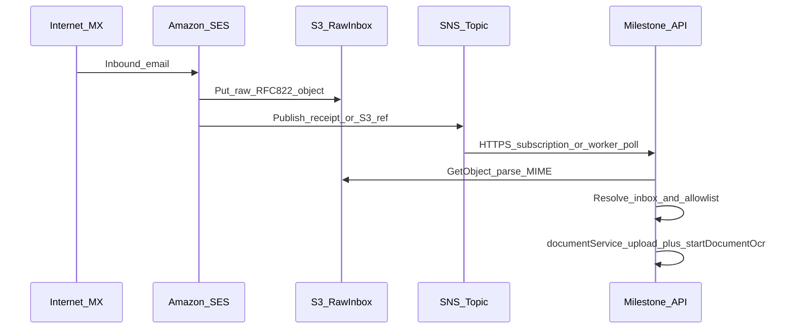

# SES + SNS inbound email for OCR (plan for discussion)

## Delivery stages (read in order)

Each stage has a **scope** and **exit criteria** so work stays sequential and reviewable.

### Stage 1 — CDK region policy (repo only)

- **Scope**: [`infrastructure/app.ts`](infrastructure/app.ts) and any stack `env` usage—remove **`us-east-1` fallback**; add **no** hardcoded region strings anywhere under `infrastructure/`. Stacks resolve account/region from **profile / `CDK_DEFAULT_*` / environment-agnostic** pattern as already agreed.
- **Exit**: `cdk synth` / `cdk deploy --profile firemedia.gary` uses the profile’s default region with no code-level override.

### Stage 2 — AWS inbound rail (CDK: dedicated **email-only** stack)

- **Scope**: Add a **new top-level CDK `Stack`** whose **sole responsibility** is **inbound email infrastructure** (name TBD, e.g. email-inbound stack). It contains: **Route 53** records on `milestone.gaari.me` for **each** inbound mail host (MX, verification TXT, any SES-required CNAMEs); **SES** domain identities + **active receipt rule set** + **one receipt rule per inbound FQDN**, each with **S3** + **SNS** actions; **S3** for raw inbound mail (shared bucket with key prefix per env and/or separate buckets—implementation choice); **one SNS topic + one SQS queue per FQDN** so notifications for `doc-inbound-staging…` never land on production’s queue. Import the public hosted zone via **`HostedZone.fromHostedZoneAttributes`** (zone id + `milestone.gaari.me`)—that is **not** a dependency on another CDK stack in this repo, only on the pre-existing AWS zone.
- **Multi-environment FQDNs (Option A — agreed naming)** — first label under `milestone.gaari.me`:
  - **Production** (unchanged broker-facing host): **`doc-inbound`** → **`doc-inbound.milestone.gaari.me`**
  - **Staging**: **`doc-inbound-staging`** → **`doc-inbound-staging.milestone.gaari.me`**
  - **Development**: **`doc-inbound-dev`** → **`doc-inbound-dev.milestone.gaari.me`**
  - **Why**: SES routes by **envelope recipient host**. Different FQDNs ⇒ different receipt rules ⇒ different **SNS topics** and **SQS queues** while staying in **one AWS account** and **one CDK stack**. A marker only inside the plus-address does **not** change SNS/SQS routing; the **hostname** does.
- **Stack boundary (hard requirement)**:
  - **No CDK dependencies** on [`MilestoneRuntimeStack`](infrastructure/milestone-runtime-stack.ts), [`MilestoneStack`](infrastructure/milestone-stack.ts), or any future app/runtime stack: **no** cross-stack references, **no** `Fn.importValue` from those stacks, **no** shared bucket from the documents stack, **no** wiring that requires another stack to be deployed first.
  - The application stack **may read** outputs this email stack publishes (e.g. via SSM or CloudFormation outputs) in **Stage 3+**—that is **runtime / ops coupling**, not a CDK construct dependency from email → app.
- **Exit**: Deploy **only** this new stack (plus Stage 1 env hygiene if needed); for **each** of the three Option A FQDNs, a test message to `ingest+…@<that-host>` yields **(1)** object in the inbound **S3** location for that rule, **(2)** publish to **that host’s SNS topic** and delivery to **that host’s SQS queue**—**no** application code and **no** other Milestone stacks required.

### Stage 3 — AWS runtime contract (config + IAM + consumer choice)

- **Scope**: **SSM parameters** (or agreed config surface) for **this deployment environment only**: inbound bucket name (or prefix contract), **SNS topic ARN**, **SQS queue URL**, **`mail-fqdn`** matching the app’s DB and UI (`EMAIL_INBOUND_MAIL_FQDN` must equal the FQDN for that env’s ingest addresses). **IAM** policy for the Node runtime (task role or instance profile) to `s3:GetObject` on the inbound raw-mail bucket/prefix and `sqs:ReceiveMessage` / `DeleteMessage` / `ChangeMessageVisibility` on **that env’s** notify queue only (avoid one EC2 role subscribing to all three queues unless you run three fleets). **MVP consumer**: SNS → **SQS** with in-app long poll (implemented in Stage 6); optional later: SNS → HTTPS webhook.
- **If SNS → HTTPS (webhook)**: SNS must be subscribed to a **fixed HTTPS URL** that AWS can reach from the internet. In practice that means a **stable DNS hostname** (a “named” endpoint—e.g. `https://api.<your-app-domain>/webhooks/sns/email-inbound` or similar), a valid **TLS certificate**, and a path you keep stable (changing the URL requires re-subscribing the SNS subscription). Ephemeral dev URLs (ngrok without reserved domain) are awkward for anything beyond quick tests.
- **If SNS → SQS**: the SNS **subscription endpoint** is the **SQS queue URL** (AWS-managed); your app does **not** need a public webhook URL for SNS to deliver— the worker **polls SQS** with IAM. You still need outbound network from the app to AWS APIs.
- **Exit**: A running app (or worker) can **read config**, **assume credentials**, and **receive** (or poll) a test notification end-to-end.

### Stage 4 — Data layer (Drizzle migrations)

- **Scope**: Tables for **ingest inboxes** (short code, optional `platform_key`, revoke/regenerate), **optional allow-list** per inbox, **ingest events** for idempotency (e.g. S3 key + content hash, status, links to `documents` / `processes` when done).
- **Exit**: Migrations applied; no ingest handler required yet.

### Stage 5 — Control plane (API + settings UI contract)

- **Scope**: Authenticated APIs for **create / list / revoke / regenerate** inbox, **allow-list** CRUD; response includes the **full ingest address** users paste into brokers. OpenAPI or shared types as per repo norms.
- **Exit**: A logged-in user can mint an address and see it in settings; revoked addresses are rejected at resolution time (Stage 6).

### Stage 6 — Ingest execution (server path to OCR)

- **Scope**: Unauthenticated (SNS-verified) route or worker: verify SNS, fetch S3, parse MIME, resolve inbox + allow-list, optional `platformKey`, **`documentService.upload` + `startDocumentOcr`** under `runWithContext({ userAccountId }, …)`.
- **Exit**: End-to-end: email → S3 → handler → **`documents` / `processes` / `ocr_jobs`** rows as today’s HTTP extract path.

### Stage 7 — Deferred / backlog (no MVP commitment)

- **Scope**: Items in **Deferred / later discussion** below (body-as-input, global document hashing, notifications, batch UX, S3 lifecycle, etc.).
- **Exit**: N/A—tracked as separate design or follow-on tickets.

## AWS account, profile, and region

- **CLI / CDK profile**: `firemedia.gary` (use consistently for `cdk deploy`, `cdk synth`, and AWS CLI checks).
- **Region policy (agreed)**:
  - **No explicit region strings in CDK code** (no literals like `eu-west-2` or `us-east-1` in `infrastructure/` for stack or construct `region`).
  - **Deploy region = profile / CDK default chain**: stacks must resolve account and region from the **same mechanism the CDK CLI uses** when you run with that profile—i.e. rely on **`CDK_DEFAULT_ACCOUNT` / `CDK_DEFAULT_REGION`** as populated by the CDK CLI from your credentials, **or** use **environment-agnostic stacks** (omit `env` on `Stack` props) so deploy-time resolution uses the active profile’s default region without baking a region into the app code.
  - **Remove bad fallback**: [`infrastructure/app.ts`](infrastructure/app.ts) currently uses `process.env.CDK_DEFAULT_REGION || "us-east-1"`, which **overrides** the profile’s intent when `CDK_DEFAULT_REGION` is unset. Implementation must **delete that `us-east-1` fallback** and must **not** replace it with another hardcoded region; if `env` is kept, use only `CDK_DEFAULT_*` without a string fallback, or omit `env` per CDK guidance so region always follows the profile at deploy time.
  - **Operational note**: today this profile’s default region is **`eu-west-2`**; that is **documentation / ops only**, not something to encode in TypeScript. **SES receiving** must be supported in whatever region the profile resolves to—see [Regions and Amazon SES](https://docs.aws.amazon.com/ses/latest/dg/regions.html) and [Email receiving with Amazon SES](https://docs.aws.amazon.com/ses/latest/dg/receiving-email.html).
- **Co-location**: keep SES, S3 inbound, SNS (and any SQS subscriber) in the **same** resolved region as the stack deployment; **Route 53** record APIs are global but records attach to the existing zone in the same account.

## Route 53 (existing zone)

- **Hosted zone ID**: `Z011372133ABJ2GF8XQIJ`
- **Zone apex (`zoneName`)**: `milestone.gaari.me` — use `HostedZone.fromHostedZoneAttributes({ hostedZoneId: "Z011372133ABJ2GF8XQIJ", zoneName: "milestone.gaari.me" })` in CDK.
- **Cross-account delegation (important)**: `milestone.gaari.me` is a **delegated subdomain**: the **parent zone** lives in **another AWS account**, and the parent has **NS records** pointing at this hosted zone’s **nameservers** (namespace delegation). **CDK in this account only manages records inside `milestone.gaari.me`**; you do **not** need CDK in the parent account for SES inbound on e.g. `inbound.milestone.gaari.me`—create **MX**, **TXT** (verification), and any other SES DNS **as records under this zone’s apex or a child label** (e.g. `inbound.milestone.gaari.me`).
- **Inbound mail hostnames (Option A — agreed)**: three first labels under `milestone.gaari.me`, each with its own SES identity, MX, DKIM, receipt rule, SNS topic, and SQS queue (see Stage 2). Production keeps the short label **`doc-inbound`**; non-prod uses **`doc-inbound-staging`** and **`doc-inbound-dev`**. CDK should still allow **context overrides** if a deploy needs a temporary label, but these three names are the **product default**.
- **SSM / deploy convention (to document in infra README)**: either **separate SSM parameter paths per environment** (e.g. `/milestone/prod/email-inbound/…` vs `/milestone/staging/…`) with each EC2/deploy loading one tree, **or** a single path tree where only one stack instance publishes per account—**the invariant** is: **the app’s `EMAIL_INBOUND_*` and queue URL must refer to the same FQDN rail as the database** (staging app + staging DB + staging FQDN + staging queue).

## Goals (agreed direction)

- **One AWS account, isolated env rails (Option A)**: production, staging, and development each use a **distinct inbound FQDN** (see Route 53 / Stage 2) so SES routes to **separate SNS topics and SQS queues**; app/runtime config (`EMAIL_INBOUND_MAIL_FQDN`, queue URL, topic ARN, DB) must stay **consistent per environment**—no shared queue across prod and non-prod.
- **AWS-first MVP**: use **Amazon SES** for inbound mail and **SNS** as the push signal (no Lambda required for the first cut if you accept an HTTP(S) subscriber or a small in-app poller—see below).
- **Tenancy model (Option A + Option B)**: each user can **manually create** one or more ingest inboxes in settings; each inbox has a **generated short code** in the address; inboxes can be **revoked and regenerated** (old address stops working). Each inbox may optionally define a **sender allow-list** (normalized `From` addresses or domains).
- **Platform assignment**: when creating an inbox, the user may **optionally bind a `platformKey`**; if unset, rely on existing OCR behaviour to **infer platform** from the document (already supported in the pipeline).
- **Content sources**: OCR input may be **attachments** and/or **email body**—treat as an open product/engineering decision (see “Deferred / later discussion”).
- **Idempotency**: you want a **hash-based** approach for email ingest and are open to extending that idea to **all documents**—flagged for a separate design thread so it does not silently change current HTTP-upload semantics.

## What SES actually stores in S3

- For inbound receipt rules with an **S3 action**, SES writes the **entire raw email** as received: a single object whose bytes are the **RFC 822 / MIME message** (what people colloquially call an **`.eml`**). SES does not guarantee a filename extension; the object is still parseable MIME.
- **SNS** (whether as a second SES receipt-rule action or via **S3 event notifications → SNS**) typically delivers a **small JSON envelope** (metadata, receipt fields, and/or **S3 bucket + object key**). Your service should **fetch the object from S3** and parse MIME (attachments + `text/plain` / `text/html` parts).
- **MVP implication**: treat **S3 object key + stable hash of object bytes** (or of normalized MIME) as the natural idempotency handle for “this exact inbound artefact,” separate from any future “document dedupe across channels.”

## High-level flow

## AWS wiring (CDK / ops sketch)

- **Dedicated email stack only** (Stage 2): all resources below live in the **new email stack**, not inside [`MilestoneRuntimeStack`](infrastructure/milestone-runtime-stack.ts) or [`MilestoneStack`](infrastructure/milestone-stack.ts). Stage 1 still covers [`infrastructure/app.ts`](infrastructure/app.ts) env hygiene for **all** stacks instantiated there, including registering this new stack.
- **New CDK resources** in that email stack (no SES in repo yet):
  - **Route 53**: `HostedZone.fromHostedZoneAttributes({ hostedZoneId: "Z011372133ABJ2GF8XQIJ", zoneName: "milestone.gaari.me" })`, then for **each** of the three Option A FQDNs: **`MxRecord` / `TxtRecord`** (and any CNAMEs SES requires) for SES domain verification and **inbound MX** (per [SES receiving email](https://docs.aws.amazon.com/ses/latest/dg/receiving-email-getting-started.html) requirements). Delegation from the parent account is already satisfied by existing **NS** at the parent; no change there for MVP unless SES asks for something at the parent apex (it should not for child hosts under `milestone.gaari.me`).
  - **SES**: **three** `EmailIdentity` (or domain identity) resources—one per FQDN; **one receipt rule set** (active in the account/region) containing **three receipt rules**, each `recipients: [<that FQDN>]` with **S3 action** (raw object) + **SNS action** (notification JSON) pointing at **that rule’s dedicated SNS topic** (so staging mail never publishes to production’s topic).
  - **S3**: one inbound bucket with **key prefix per environment** (e.g. `raw/prod/`, `raw/staging/`, `raw/dev/`) **or** three buckets—pick one for IAM clarity; raw object keys in SNS still identify bucket + key for `GetObject`.
  - **SNS + SQS**: **three topics**, each subscribed to **one SQS queue** (`…-notify`, `…-notify-staging`, `…-notify-dev` or similar stable names); SSM publishes each queue URL / topic ARN / mail FQDN for wiring **runtime** (Stage 3 / app deploy).
- **Secrets**: SNS subscription confirmation URL handling; if using **HTTPS to Express**, you need a **public endpoint** and to verify SNS message signatures (AWS signing cert URL pattern). Alternative MVP: **SQS subscribed to SNS** and a lightweight worker loop in the API process—still “SNS-based,” adds durability without public webhook.
- **IAM**: least-privilege for API role/user to `s3:GetObject` on the inbound prefix and (if used) `sns:Subscribe` / queue receive.

## Application data model (sketch)

- **`email_ingest_inboxes`**: `id`, `user_account_id`, **`short_code`** (unique among **active** rows), `platform_key` nullable, **`allowed_senders` JSONB** (array of full emails or `@domain` suffixes; empty = allow any), `status` (`active` | `revoked`), `created_at`, `revoked_at`, optional `replaced_by_inbox_id` for audit. *(Implemented: no separate allow-list table.)*
- **`email_ingest_events`** (idempotency + audit): `s3_bucket`, `s3_key`, **`content_sha256`** (or similar), `message_id_rfc5322` if extractable, `processing_status`, `error`, links to created `document_id` / `process_id` rows when successful.

**Address format** (agreed shape): `{localPartPrefix}+{shortCode}@{mailFqdn}` where `mailFqdn` is one of the three Option A hosts (e.g. **`ingest+{shortCode}@doc-inbound.milestone.gaari.me`** for production; staging/dev use **`doc-inbound-staging`** / **`doc-inbound-dev`** as the host). The **`shortCode` maps to exactly one active inbox row** in **that environment’s database**; regeneration creates a new row and revokes the prior mapping. **Brokers must use the FQDN that matches the environment** (prod vs staging vs dev); there is no safe “marker only in the plus-tag” routing across envs on a single queue.

## Ingest handler logic (server)

1. **Verify SNS** authenticity (signature + cert chain) if HTTP; or dequeue from SQS with visibility timeout.
2. **Resolve S3 object**, stream to temp buffer or bounded stream, compute **hash** for idempotency lookup in `email_ingest_events`.
3. **Parse MIME** (Node: `mailparser` is common; evaluate size limits and streaming if you expect large mail).
4. **Resolve tenant**: parse `Delivered-To` / `To` / `Envelope-To` / `X-Original-To` (provider-dependent) to find the **short code**; load inbox; **403/ignore** if revoked or unknown.
5. **Optional allow-list**: compare parsed `From` against allowed senders/domains; reject or quarantine with explicit log + metric.
6. **Platform key**: use inbox-bound `platformKey` if set; else pass **`unknown`** (or omit and let existing default) and let OCR infer—aligned with current [`server/services/process/document-ocr.ts`](server/services/process/document-ocr.ts) + pipeline behaviour.
7. **Produce “documents” for OCR**:
   - **Attachments**: for each supported type (PDF first), build a Multer-like file object and call existing **`documentService.upload`** then **`startDocumentOcr`** under **`runWithContext({ userAccountId }, …)`** (same pattern as asset-scoped extract in [`server/routes/assets.ts`](server/routes/assets.ts)).
   - **Body**: decide policy (plain text preferred over HTML strip; or HTML→text); likely **materialize a synthetic `.txt` or `.html` “document”** only if the pipeline accepts it—**requires explicit pipeline contract** (see deferred section).

## Security notes (non-negotiables for MVP)

- Ingest address = **bearer capability**; revocation must be immediate and auditable.
- **Size caps** for S3 objects and parsed parts; defence against zip bombs / decompression bombs if you ever unzip.
- **No user session** on this path: auth is **SNS verification + inbox secret mapping**, not `requireUser` cookies.

## Integration with existing OCR artefacts

- Reuse **`documents`**, **`processes`**, **`ocr_jobs`** as today—no change required to the core job model for “another front door that ends at `startDocumentOcr`.”
- Existing reconciliation in [`server/services/process/process-reconcile.ts`](server/services/process/process-reconcile.ts) continues to apply to jobs started from email.

---

## Deferred / later discussion (explicit backlog)

**Stage 7** tracks these as follow-on design threads (no MVP implementation commitment):

1. **Email body as OCR input**: whether to support `text/html` only, `text/plain` only, both, or “HTML rendered to PDF” for the LLM path; how that maps to `mime` types in `documents` and whether `runFullDocumentOcrPipeline` should accept non-PDF inputs today.
2. **Cross-channel document dedupe (hash on all uploads)**: content-hash deduplication for **normal HTTP uploads** vs **email** vs **future imports**; collision policy (reject vs link vs new version); interaction with user expectations and legal/audit retention.
3. **Idempotency granularity**: whole-message hash vs **per-attachment hash** inside the same email; partial retries when one attachment fails.
4. **User notifications**: in-app only vs email-back confirmation vs “processing failed” alerts—especially when body-only statements are rejected.
5. **Multi-attachment batch semantics**: independent jobs (current model) vs grouped UI/review session.
6. **Operational choices for SNS MVP**: **HTTPS subscription to Express** (simplest if publicly reachable) vs **SQS behind SNS** (more robust, no inbound firewall gymnastics, easier retries).
7. **SES/S3 object format details**: retention/TTL on raw `.eml` in S3, encryption (SSE-S3 vs KMS), and whether to delete S3 after successful processing.
