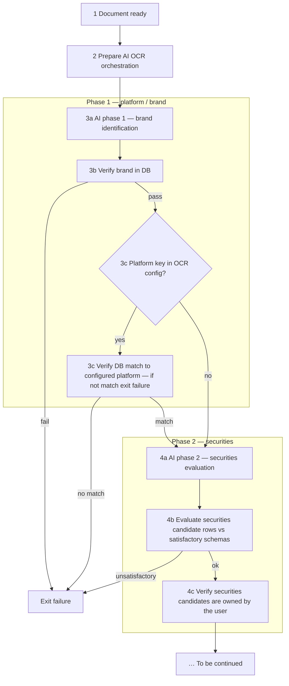
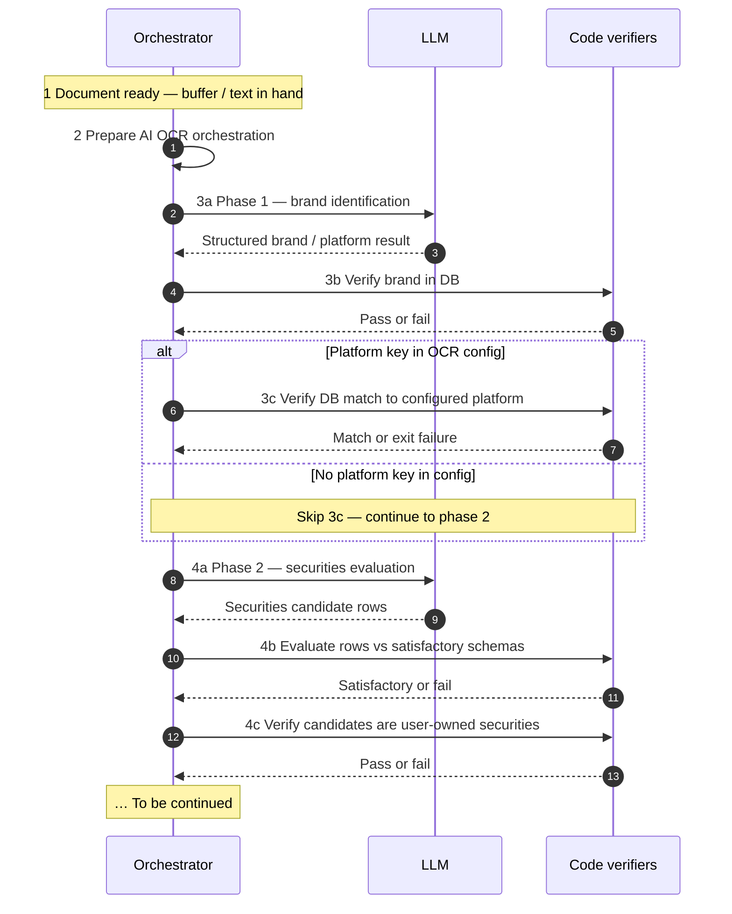

# Transaction OCR flow (living diagram)

This file holds the **authoritative mermaid** for transaction-related OCR. **Extend it here** as the pipeline evolves.

**Related plans:** [DocumentUpload OCR Refactor](../.cursor/plans/documentupload_ocr_refactor_1e50c3b2.plan.md) (upload → async job → WebSocket), [OCR text-first pipeline](../.cursor/plans/ocr_text-first_pipeline.plan.md) (PDF text-first, security-transaction capture, resolution, email-origin convergence).

## Model (how to read this)

- **Multiple AI runs** for **different jobs** (e.g. brand / platform vs securities evaluation)—each with its own **messages / agent role** and **structured purpose**, not one long undifferentiated chat.
- **Orchestration** (step 2) sets up that **multi-phase** flow (routing, tools, schemas, conversation state).
- **Verification** steps (**3b**, **3c**, **4b**, **4c**) are **not** the same as the LLM calls: DB checks, config vs DB alignment, Zod / schema gates, and **user portfolio** checks sit **between** or **after** AI phases as appropriate.

**Legend**

- **1 → 2:** Nothing AI runs until there is a **document**; orchestration prepares **phases**, prompts, and outputs (e.g. LangChain-style graphs or explicit runners).
- **Phase 1:** **3a** is its own **model run**; **3b** is deterministic / service verification against **`platforms`** (or equivalent); **3c** runs **only when** a **platform key** was supplied for this OCR run—confirm the resolved row **matches** that config; otherwise **failure** (no silent mismatch).
- **Phase 2:** **4a** is a **second** model run (securities evaluation); **4b** is schema / shape validation on **candidate rows**; **4c** is **ownership** (candidates must map to securities the **user** actually holds—cache / DB, not model assertion alone).
- **TBC:** Further steps (persistence, UI confirm, more AI phases, etc.) go after **4c**.

---

## Sequence view (AI calls vs code verifiers)

The **flowchart** above is best for **branching and outcomes** (what can fail, what is skipped). The **sequence diagram** below is best for **time order** and **who talks to whom**: each **LLM** invocation is explicit, and **code** runs **between** phases to validate structured output before the next model call or exit.

Keep both diagrams **in sync** when steps change.

**Legend (sequence)**

- **Orchestrator** — your runner / graph / LangChain chain: holds document context, chooses the next step, passes **validated** inputs into the next LLM call.
- **LLM** — **separate** completions (phase 1 vs phase 2), each with its own **messages** and **output schema**; not one endless thread unless you deliberately reuse conversation state.
- **Code verifiers** — **synchronous** checks in process (DB lookups, Zod parse, portfolio membership, config vs resolved row). Failures **short-circuit** before the next LLM call where the flowchart shows an edge to **Exit failure**.
