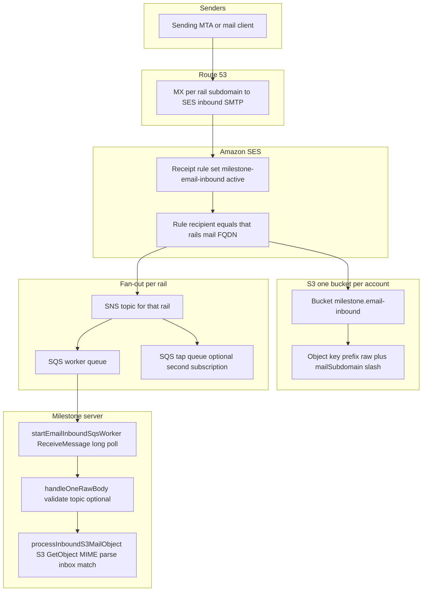
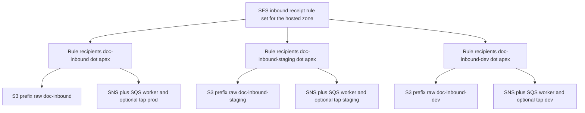
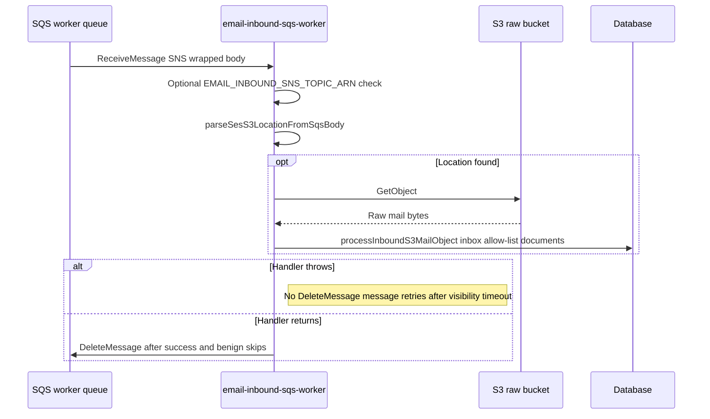

# Email ingress: environments and flows

This document describes how **document email ingress** is wired in AWS and how each **environment rail** (production, staging, development) maps to DNS, SES, S3, SNS, and SQS. It complements the deploy-oriented notes in [`infrastructure/README.md`](../infrastructure/README.md) and the CLI tooling in [`email-inbound-queue-util.md`](./email-inbound-queue-util.md).

**Source of truth in code**

- CDK stack: [`infrastructure/milestone-email-inbound-stack.ts`](../infrastructure/milestone-email-inbound-stack.ts)
- SSM parameter names and rail list: [`infrastructure/ssm-email-inbound.ts`](../infrastructure/ssm-email-inbound.ts)
- Runtime worker: [`server/services/email-ingest/email-inbound-sqs-worker.ts`](../server/services/email-ingest/email-inbound-sqs-worker.ts)
- After a notification is accepted: [`server/services/email-ingest/process-inbound-s3-mail.ts`](../server/services/email-ingest/process-inbound-s3-mail.ts)

---

## Concepts

| Term | Meaning |
| ---- | ------- |
| **Rail** | One vertical slice: MX host + SES identity + receipt rule + SNS topic + SQS **worker** queue (and optional **tap** queue). Each rail corresponds to an app environment. |
| **Worker queue** | The SQS queue the Milestone process long-polls (`EMAIL_INBOUND_SQS_QUEUE_URL`). SNS delivers the same **SES receipt notification** JSON here. |
| **Tap queue** | Optional second SQS subscription on the **same** SNS topic (CDK context `emailInboundSnsTapQueues=true`). Duplicate messages for operators; does not replace the worker queue. |
| **Shared raw bucket** | One S3 bucket for all rails (`milestone.email-inbound`). Objects are namespaced by key prefix per rail (`raw/<mailSubdomain>/`). |

---

## Environment rails (three FQDNs)

All hosts live under the same Route 53 **apex zone** (for example `milestone.gaari.me`). The **mail subdomain** is the first label; the full **inbound FQDN** is `<subdomain>.<apex>`.

| Environment | `mailSubdomain` | SQS worker queue name (CDK) | Typical use |
| ----------- | --------------- | --------------------------- | ----------- |
| Production | `doc-inbound` | `milestone-email-inbound-notify` | Live ingest addresses |
| Staging | `doc-inbound-staging` | `milestone-email-inbound-notify-staging` | Pre-production |
| Development | `doc-inbound-dev` | `milestone-email-inbound-notify-dev` | Dev / local parity |

Tap queues, when enabled, are named **`<worker-queue-name>-tap`** (for example `milestone-email-inbound-notify-dev-tap`).

Per-rail values are published under SSM prefix **`/milestone/email-inbound/rails/<mailSubdomain>/`**, including `mail-fqdn`, `sns-topic-arn`, `sqs-queue-url`, and (if tap queues are deployed) `sqs-tap-queue-url`.

---

## End-to-end flow (one rail)

High-level path from the internet to the app process. The diagram is generic; the **recipient host** and **queue/topic names** change per rail (see table above).

**Notes**

1. **SES** stores the raw RFC 822 object in **S3** and publishes an **SES receipt notification** to **SNS** (subject line in the console is often “Amazon SES Email Receipt Notification”). The SQS body is the usual SNS → JSON envelope whose `Message` field contains that SES JSON (including `mail`, `receipt`, and the S3 action with `bucketName` / `objectKey`).
2. **SNS** has two SQS subscriptions when tap queues are on: the **worker** queue and the **tap** queue each get a **separate copy** of the message.
3. The worker **deletes** the SQS message after successful handling (or leaves it to retry on error). The tap queue is independent; tooling may delete or release messages there without affecting the worker copy.

---

## Three environments on one diagram

Logical isolation: **one** active SES receipt rule set and **one** raw-mail bucket, but **separate** receipt rules (by recipient FQDN), **separate** SNS topics, and **separate** SQS queues per rail. Each EC2 or local profile should point at **one** rail via `EMAIL_INBOUND_SQS_QUEUE_URL` / `EMAIL_INBOUND_MAIL_FQDN` (and CDK context `emailInboundMailSubdomain` for deploy).

---

## In-app processing (after SQS)

Once a message is read from the **worker** queue, the server parses the SNS body, resolves the **S3 bucket and key**, fetches the object, and runs the ingest pipeline (short code from recipient, inbox lookup, allow-list, document pipeline, etc.). Errors can cause **retries** until visibility timeout and processing succeed, or failed paths are recorded depending on configuration.

The worker **always** calls `DeleteMessage` after `handleOneRawBody` returns normally — including when it **logs and skips** (wrong SNS topic or body not a parseable SES→S3 receipt). Only a **thrown** error leaves the message on the queue for retry.

---

## Related commands

- **All worker + tap queue depths (no receive):** `npx tsx tools/aws/email-inbound-queue-util.ts show --depths` (see [`email-inbound-queue-util.md`](./email-inbound-queue-util.md)).
- **One rail tap + worker from env:** `exec --stats-only` with `EMAIL_INBOUND_SQS_QUEUE_URL` (and tap URL resolution as documented there).

---

## Summary

| Layer | Shared vs per rail |
| ----- | ------------------- |
| Route 53 zone | Shared; **MX record per** `mailSubdomain` |
| SES receipt rule set name | Shared (`milestone-email-inbound`) |
| SES rule recipients | **Per rail** FQDN |
| S3 bucket | **Shared** `milestone.email-inbound` |
| S3 key prefix | **Per rail** `raw/<mailSubdomain>/` |
| SNS topic | **Per rail** |
| SQS worker (+ optional tap) | **Per rail** |
| Milestone env on EC2 | **One rail** per instance via SSM / env (`emailInboundMailSubdomain`) |

If this document and CDK drift, update the **rail table** and diagrams when `EMAIL_INBOUND_RAIL_DEFINITIONS` or stack behaviour changes.
