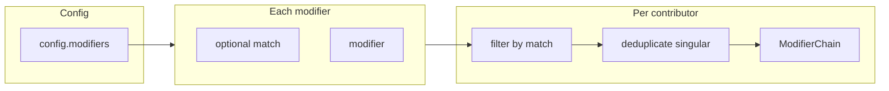

# Modifiers with optional predicate – plan

## Current state (confirmed)

- **config.modifiers**: single array on projection config ([shared/schema/projections.ts](shared/schema/projections.ts) – `baseProjectionConfigSchema`). Each element is a `ProjectionModifier` (tax, inflation, contribution_scaler, fee).
- **contributor.modifiers**: optional array on each contributor (`contributorSchema`). Currently merged with config.modifiers in [shared/utils/projection-orchestrator.ts](shared/utils/projection-orchestrator.ts) (lines 52–54): `mergeModifiers(config.modifiers, contribution.modifiers)`.

**Existing predicate pattern:** Contributor rules elsewhere use predicates (e.g. [shared/schema/projections.ts](shared/schema/projections.ts) – `taxSchema`, `limitationSchema` use `predicates: z.array(z.object({ type, value }))`).

## Goal

- Apply modifiers only to contributors that match criteria (e.g. "+100 to all ISA contributions").
- Keep a single, centralised modifier list: **config.modifiers only**.

**Example:** "Apply a contribution modification of +100 to all contributions of Asset type 'ISA'."

---

## Approach (what we are doing)

1. **Keep config.modifiers** as the only modifier list (existing property, same place).
2. **Remove contributor.modifiers** so there is no per-contributor modifier list.
3. **Add predicate functionality to config.modifiers**: each entry in `config.modifiers` may optionally include a **match** (predicate) that specifies which contributors the modifier applies to. If a modifier has no `match`, it applies to all contributors (current "global" behaviour). If it has a `match`, it applies only to contributors that satisfy the predicate.

So we extend the *element type* of the existing `config.modifiers` array with an optional `match` field; we do not add a new array (no modifierGroups) and we remove the second list (contributor.modifiers).

---

## Stages

**Stage 1 (first implementation):** Predicate on config.modifiers, remove contributor.modifiers, add unifyModifiersForContributor (or equivalent) to build the modifier chain per contributor. No new modifier types.

**Stage 2 (later):** Add **contribution_offset** as a new modifier type (fixed amount per contribution, e.g. +100 for ISA). Schema, projection-modifiers.ts, and discriminated union.

---

## Options

### 1. Predicate shape (who the modifier applies to)

- **Option 1a.** Simple match object on the modifier: `match?: { accountType?: string | string[]; contributorType?: string | string[]; referenceId?: string }`. Easy for v1; extend later.
- **Option 1b.** (type, value) array like tax/limitation. Consistent with existing schema but more verbose.

**Recommendation:** Option 1a for v1.

### 2. "+100" behaviour – new modifier type (Stage 2 only)

Current modifiers are rate/multiplier based. A fixed +100 per contribution needs an additive modifier. In **Stage 2** add **contribution_offset**: `{ type: "contribution_offset", enabled, amount: DecimalValueString }`. Applied only in contribution context (like tax / contribution_scaler). Not in Stage 1.

### 3. Merge order (per contributor)

For each contributor: (1) From `config.modifiers`, take entries that have no `match` or whose `match` matches this contributor (preserve array order). (2) Strip `match` to get a list of plain `ProjectionModifier`. (3) Run existing `mergeModifiers(...)` for singular-type dedup. (4) `createModifierChain(merged)` as today. No separate "global vs contributor" merge – only `config.modifiers`, filtered by predicate.

---

## Schema / types

- **ContributorMatchPredicate**: optional object on a modifier, e.g. `{ accountType?: string | string[]; contributorType?: string; referenceId?: string }`. Absent = applies to all. (Stage 1.)
- **config.modifiers**: same array as today; element type extended so each modifier can include optional `match?: ContributorMatchPredicate`. Existing modifiers without `match` continue to apply to everyone. (Stage 1.)
- **Remove** `contributor.modifiers` from `contributorSchema` and from the orchestrator (no more `mergeModifiers(config.modifiers, contribution.modifiers)`). Any contributor-specific behaviour is expressed as a modifier in `config.modifiers` with a `match` that targets that contributor. (Stage 1.)
- **New modifier type (Stage 2):** `contribution_offset` with `amount`; add to [projection-modifiers.ts](shared/utils/projection-modifiers.ts) and to the discriminated union in schema.

## Orchestrator change (Stage 1)

In `projectSingleContributor`: use `unifyModifiersForContributor(contributor, config.modifiers)` to get the list of modifiers that apply to this contributor (filter by match, strip match, dedupe singular types), then `createModifierChain(unified)`. Helpers: `contributorMatches(contributor, match): boolean`; `unifyModifiersForContributor` replaces the previous `mergeModifiers(config.modifiers, contribution.modifiers)` call.

---

## Summary diagram

One list (config.modifiers). No contributor.modifiers. No modifierGroups.

---

## Out of scope

- UI for editing modifier predicates or the new modifier type.
- Persistence of config (modifiers remain part of the same config object passed in).
- Changing behaviour of existing modifier types (tax, inflation, fee, contribution_scaler).
